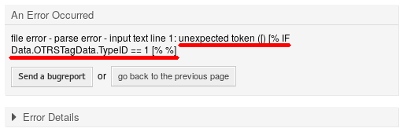

Administrator Interface
=======================

This package has no dedicated administrator interface, only extends the existing screens.

Create New Templates
--------------------

This feature enables logical if-else conditions as well as loops and much more.

To insert code snippets:

1. Open *Templates*, *Signatures* or *Salutations* module of the administrator interface.
2. Add or modify a resource in these screens.
3. Find the new icon in the Rich Text editor toolbar (the last one).

   .. figure:: images/rich-text-editor-icon.png
      :alt: Insert Code Snippet Icon

      Insert Code Snippet Icon

4. Click on the new icon to oben a new window.
5. Select *TemplateToolkit* from the *Language* drop-down.
6. Write the following lines into the text area.

   .. code-block:: none

      [% IF ( matches = Data.Language.match('^de') ) %]
      Sehr geehrte(r) [% Data.CustomerUser.UserFirstname %] [% Data.CustomerUser.UserLastname %], 
      [% ELSIF ( matches = Data.Language.match('^hu') ) %]
      Tisztelt [% Data.CustomerUser.UserLastname %] [% Data.CustomerUser.UserFirstname %]! 
      [% ELSE %]
      Dear [% Data.CustomerUser.UserFirstname %] [% Data.CustomerUser.UserLastname %], 
      [% END %]

7. Click on the *OK* button to save the code snippet.

   .. figure:: images/rich-text-editor-code-snippet.png
      :alt: Rich Text Editor Code Snippet

      Rich Text Editor Code Snippet

8. Click on the *Save* or *Save and finish* button.
9. Add the template, signature or salutation to the queue you want to use it.
10. Create a new ticket, choose a customer (for this example we will call him John Doe), then choose the queue you have configured your template for.

   If the customer language is German, it should print *Sehr geehrte(r) John Doe,*. If it is set to Hungarian, you should see *Tisztelt Doe John!*. If your customer has no language set or it is set to English, you will see *Dear John Doe,*.

As you can see, conditions in templates can be very useful, but be careful to write correct Template Toolkit syntax. If you make mistakes there, you will get an error during choosing a template.

.. seealso::

   For detailed instructions on how to write Template Toolkit code, refer to the `Template Toolkit User Manual <http://www.template-toolkit.org/docs/manual/index.html>`__ for more information.

Debugging Templates
-------------------

Writing Template Toolkit code is not too difficult compared to other languages. Nevertheless errors occur as we are all just humans. To validate your template, open the ticket create or answer screen, where you have your templates configured to be used and choose a template.

If you have mistakes in your Template Toolkit syntax, choosing a template will bring up an error screen that tell you about what went wrong and where to find the error.

Error Reason in Error Screen

In this example the OTRS system informed us, that there was an unexpected token ``[`` in the line ``[% IF Data.OTRSTagData.TypeID == 1 [% %]``. A second opening bracket was entered inside the same Template Toolkit tag, which for sure is forbidden.

To fix the error:

1. Go back to the template editing screen.
2. Edit the template and save it.
3. Start debugging the template again by creating or answering a ticket, till no more errors are found and your template comes up as desired.
