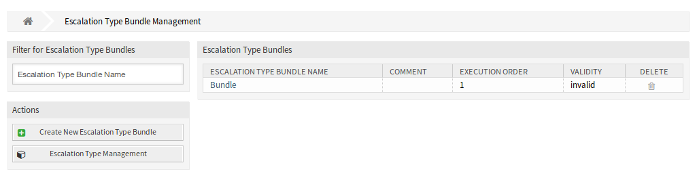
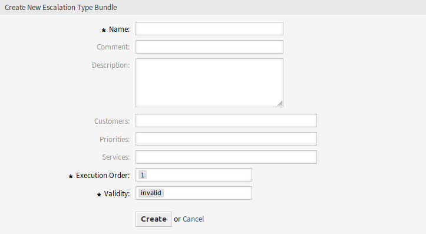
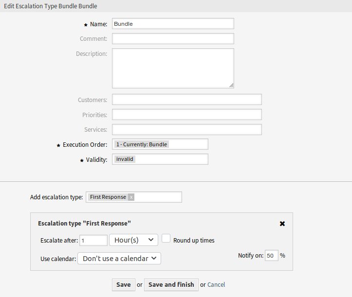
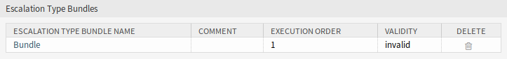

Escalation Type Bundles
=======================

The :doc:`escalation-types` can be grouped to so-called bundles. Bundles can be connected to SLAs, customers, priorities and services in order to define special escalations on a per-customer basis and depending on certain calendar settings.

After installation of the package a module *Escalation Type Bundles* will be available in the *Ticket Settings* group of the administrator interface.

   Escalation Type Bundle Management Screen

The advanced escalations package works with the relationships chain *Escalation type → Escalation type bundle → SLA*.

One or more escalation type should be created and assigned to an escalation type bundle, and one or more escalation bundles should be related to one or more SLAs. The relationship between *Customer → Service → SLA* is the normal one on the system.

Manage Escalation Type Bundles
------------------------------

To create a new escalation type bundle:

1. Click on the *Create New Escalation Type Bundle* button in the left sidebar.
2. Fill in the required fields.
3. Click on the *Create* button.
4. You will be redirected to *Edit Escalation Type Bundle* screen to edit the escalation type details.

   Create New Escalation Type Bundle Screen

To edit an escalation type bundle:

1. Click on an escalation type bundle in the list of escalation types bundles or you are already redirected here from *Create New Escalation Type Bundle* screen.
2. Modify the fields and the escalation type bundle details.
3. Click on the *Save* or *Save and finish* button.

   Edit Escalation Type Bundle Screen

To delete an escalation type bundle:

1. Click on the trash icon in the *Delete* column.
2. Click on the *OK* button in the confirmation dialog.

   Delete Escalation Type Bundle Screen

Escalation Type Bundle Settings
-------------------------------

The following settings are available when adding or editing this resource. The fields marked with an asterisk are mandatory.

Name \*
   The name of this resource. Any type of characters can be entered to this field including uppercase letters and spaces. The name will be displayed in the overview table.

Comment
   Add additional information to this resource. It is recommended to always fill this field as a description of the resource with a full sentence for better clarity, because the comment will be also displayed in the overview table.

Description
   Like comment, but longer text can be added here.

Customers
   Select a customer from the drop-down list. If one or more customers are selected, the bundle will only take effect on tickets which are assigned to one of the selected customers.

Priorities
   Select a priority from the drop-down list. If one or more priorities are selected, the bundle will only take effect on tickets which matches one of the selected priorities.

Services
   Select a service from the drop-down list. If one or more services are selected, the bundle will only take effect on tickets which matches one of the selected services.

Execution order \*
   Select, in which order should the escalation bundles be evaluated.

Validity \*
   Set the validity of this resource. Each resource can be used in OTRS only, if this field is set to *valid*. Setting this field to *invalid* or *invalid-temporarily* will disable the use of the resource.

Add escalation type
   Bundles can contain several escalation types. On a bundle, all information regarding the time for the escalation is being stored.

   Escalate after
      Define the escalation time span and unit.

   Round up times
      Check this box to round up the times, so the start of the escalation will take place at the next full time unit.

      For example if *1 hour* is set as escalation time and a ticket is being created at 10:23, the escalation will start at 11:00, rounding up to the next full hour.

   Use calendar
      Select a calendar to used by the escalation. If no calendar is being used, a 24/7/365 calendar without weekends or other free days will be assumed.

   Notify on
      Define the notification time.
