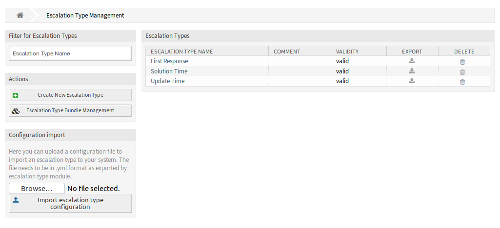
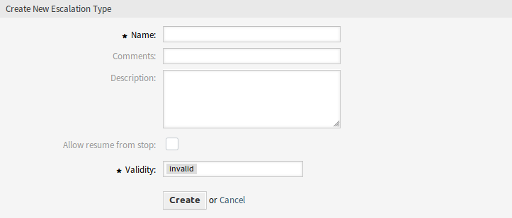
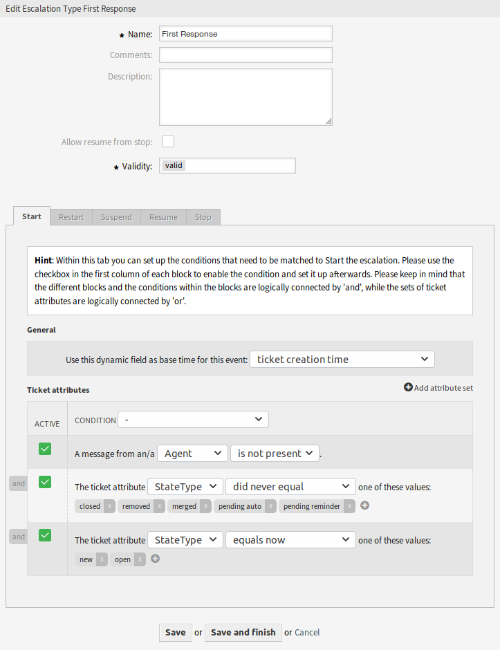
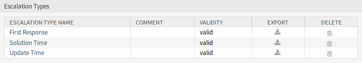

Escalation Types
================

Escalation types contain generic information about the conditions that need to be matched in order to start, restart, suspend, resume or stop an escalation on a ticket. The type itself does not contain any time settings (e.g. how many hours need to pass until the escalation starts).

Use this screen to add escalation types to the system. After installation of the package some escalation types are already added. The escalation type management screen is available in the *Escalation Types* module of the *Ticket Settings* group.

   Escalation Type Management Screen

Manage Escalation Types
-----------------------

To create a new escalation type:

1. Click on the *Create New Escalation Type* button in the left sidebar.
2. Fill in the required fields.
3. Click on the *Create* button.
4. You will be redirected to *Edit Escalation Type* screen to edit the escalation type details.

   Create New Escalation Type Screen

To edit an escalation type:

1. Click on an escalation type in the list of escalation types or you are already redirected here from *Create New Escalation Type* screen.
2. Modify the fields and the escalation type details.
3. Click on the *Save* or *Save and finish* button.

   Edit Escalation Type Screen

To delete an escalation type:

1. Click on the trash icon in the *Delete* column.
2. Click on the *OK* button in the confirmation dialog.

   Delete Escalation Type Screen

To export an escalation type:

1. Click on the export icon in the *Export* column.
2. Choose a location in your computer to save the ``Export_EscalationTypeID_X.yml`` file.

To import an escalation type:

1. Click on the *Browse…* button in the left sidebar.
2. Select a previously exported ``.yml`` file.
3. Click on the *Import escalation type configuration* button.

Escalation Type Settings
------------------------

The following settings are available when adding or editing this resource. The fields marked with an asterisk are mandatory.

Name \*
   The name of this resource. Any type of characters can be entered to this field including uppercase letters and spaces. The name will be displayed in the overview table.

Comment
   Add additional information to this resource. It is recommended to always fill this field as a description of the resource with a full sentence for better clarity, because the comment will be also displayed in the overview table.

Description
   Like comment, but longer text can be added here.

Allow resume from stop
   If this is checked, it allows this escalation to be resumed although it had already been stopped at some point in the past (of course only if the related resume conditions match).

   .. note::

      This setting will only apply on escalations which have not yet reached the escalation time, which means that you should not expect escalations which have already been stopped to resume after enabling the checkbox.

   If the resume conditions match on an escalation type which has *Allow resume from stop* enabled, the escalation will be resumed with the time that was still left on this escalation when it was stopped (which means *was fulfilled*).

Validity \*
   Set the validity of this resource. Each resource can be used in OTRS only, if this field is set to *valid*. Setting this field to *invalid* or *invalid-temporarily* will disable the use of the resource.

Condition types
---------------

This widget has five tabs for *Start*, *Restart*, *Suspend*, *Resume* and *Stop* events. The following options are available for the tabs.

General
~~~~~~~

This setting is only available for the *Start* and *Restart* event of the escalation. This setting controls if the ticket creation time or the time of the current action should be taken as base time for the start or the restart of the escalation.

Example: If you set up *current time* as base time for the restart event, the full escalation time will be available (e.g. 1 hour) if the restart condition matches. If you set up *ticket creation time*, the escalation will restart based on the creation time of the ticket. This could be useful if you close a ticket as successful (which stops your escalation) but it turns out that the problem has not been solved.

You are also able to set a date or a date-time dynamic field as base time. If you create a ticket with this dynamic field filled and the escalation start then the value of the dynamic field will be used as base time. If the configured dynamic field is not filled then the fallback for the base time is used (current time or ticket creation time or no time value - escalation will only start if the dynamic field is filled).

Ticket Attributes
~~~~~~~~~~~~~~~~~

Several attribute sets can be set up. Each of these sets can contain several attribute conditions. The sets are logically connected by *OR*, which means that one of the sets has to be matched in order to trigger the event. The conditions within a set are logically connected by *AND*, which means that all of the conditions have to match in order to verify the whole set.

After adding a new set, you can add conditions to this set by using the *Add attribute set* button on the top right of the widget. After enabling the added condition in the widget, you can choose what ticket attribute you want to check.

.. note::

   All configured conditions are used to evaluate values present on each action, which is defined as a snapshot of the ticket values taken from the ticket history. The time window for this snapshot is defined by the ``TicketHistorySplitTimeThreshold`` setting. All actions for a ticket are evaluated one by one each time the escalation is recalculated.

The ticket created by a customer
   This condition type means that the ticket has to be created by customer (by sending an email, using the customer front-end or by an agent using the ticket phone mask).

Ticket Attributes
   In this drop-down menu you can choose from a list of match types:

   equals now
      (Is) – One of the configured ticket attributes should match the particular attribute value from the action which is currently being evaluated. The condition evaluates as true if there is at least one match.

   doesn't equal now
      (Is not) – None of the configured ticket attributes should match the particular attribute value from the action which is currently being evaluated. The condition evaluates as true if there is no match.

   equaled
      (Was) - One of the configured ticket attributes should match the particular attribute value from the action which is currently being evaluated. All actions from the history of the particular ticket are being evaluated. The condition evaluates as true if there is at least one match in one of the historical ticket attribute values.

   did never equal
      (Was never) - None of the configured ticket attributes should match the particular attribute value from the action which is currently being evaluated. All actions from the history of the particular ticket are being evaluated. The condition evaluates as true if there is no match in one of the historical ticket attribute values.

   changed to
      (Changed to) – The configured ticket attribute changed to one of the given values. This implies that the value was different before (= on the previous action).

   equals previous
      (Was previously) – At least one of the configured ticket attributes should match the particular attribute value on the previous action, which means going back exactly one step in the ticket history. The condition evaluates as true if there is a match in one of the historical ticket attribute values of the previous action.

   doesn't equal previous
      (Was not previously) – None of the configured ticket attributes should match the particular attribute value on the previous action, which means going back exactly one step in the ticket history. The condition evaluates as true if there is no match in the historical ticket attribute values of the previous action.

Message presence
   This condition type defines if a customer or agent message must be/must not be present.

Message delivery
   If enabled, this will define that the customer or agent has to send a message to match the condition.

To remove a condition, uncheck the checkbox in the *Active* column, and click on the *Save* button.
