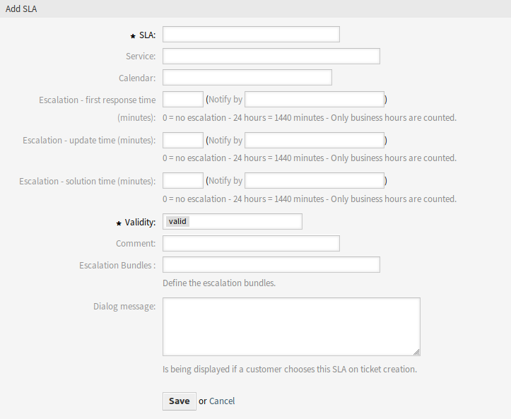

Service Level Agreements
========================

It is possible to assign escalation type bundles to an SLA. Therefore, a multiselect field has been added to the *Add Service Level Agreement* screen.

   Add Service Level Agreement Screen

New Field
---------

Escalation Bundles
   Here you can choose from a list of all available bundles which should be assigned to this SLA. Assigning a bundle to a SLA will cause the escalation types, which are assigned to this bundle, to be considered for a ticket which has this SLA set.

.. note::

   The calendar setting in the SLA has no effect for the advanced escalations feature.
