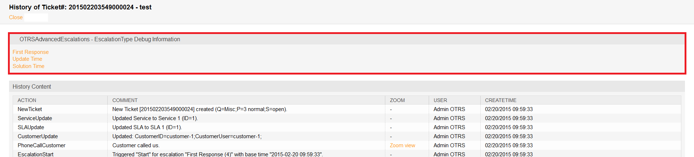
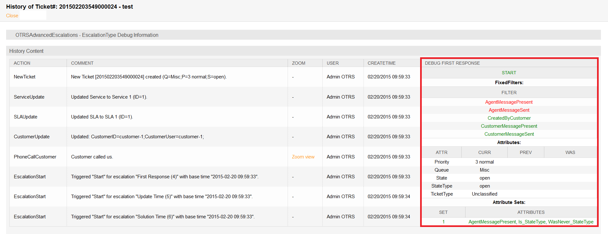

Ticket Zoom
===========

Display Escalations in Overviews
--------------------------------

All advanced escalations that are associated to a ticket will be shown in *Escalation Information* widget in *Ticket Zoom* screen.

The escalations are displayed with a colored background indicating the current escalation state for better visibility.

- Green background: the escalation time has not been reached.
- Yellow background: the escalation notification time has been reached.
- Red background: the escalation time has been reached.
- Grey background: the escalation is suspended.

Debug escalation
----------------

It is not easy to understand how advanced escalations works. It cut the ticket history entries into snapshots to calculate the escalation. Each snapshot will contain the the current state of the ticket with all all related data of the current time of the snapshot. A snapshot is normally about 5 seconds of the ticket history.

For more information about a single escalation and how it is calculated you can take a look at the ticket history. If your system has a customer ID and a SLA with related escalation bundles and types then you will be able to debug these, based on the ticket history of the current ticket.

   Escalation Debug Mode – Select Escalation Type

After clicking on a escalation type you will get a detailed information about the parameters, attribute values and conditions.

   Escalation Debug Mode – Debug Snapshot of Escalation Type

Escalation State
~~~~~~~~~~~~~~~~

The first block contains the state of the current escalation type. In the example it will calculate the start condition of the escalation type and it was successfully (success = green, red = no change of the state). Basically for each snapshot it is possible that the escalation will calculate multiple state if it don't match to the first.

The order of the calculated states is based on the running, suspend or not running state of the escalation. Here a short technical overview:

.. code-block: Perl

   my %EscalationStatesMachine = (
       NotRunning => ['Start'],
       Running    => [ 'Suspend', 'Restart', 'Stop' ],
       Suspended  => [ 'Resume', 'Stop' ],
   );

So if the escalation is not running then it will only try to move to the *Start* state of the escalation. If suspended then only *Resume* or *Stop* are possible as next states.

Escalation Filters
~~~~~~~~~~~~~~~~~~

The filter values are relating to the agent and customer message send or present attributes which are set in the conditions. If a filter is green then the filter is matched and red if a filter is not matched.

- ``AgentMessagePresent``: A message from a agent is present.
- ``AgentMessageSent``: An agent sent a message.
- ``CustomerMessagePresent``: A message from a customer is present.
- ``CustomerMessageSent``: A customer sent a message.

Escalation Attributes
~~~~~~~~~~~~~~~~~~~~~

The block with the attributes of the snapshot will contain all attributes which will be used for checking the condition of the escalation ticket attributes.

There are 4 columns:

- ``ATTR``: This column contains the ticket attribute.
- ``CURR``: This column contains the current value of the snapshot. This value will be used for the calculation of *equals now*, *doesn't equals now* and *change to* conditions.
- ``PREV``: This column contains the value of the previous snapshot. This value will be used for the calculation of *equals previous*, *doesn't equals previous* and *change to* conditions.
- ``WAS``: This column contains the value of all previous snapshot. This value will be used for the calculation of *did never equal*, *equaled* conditions.

Escalation Attribute Sets
~~~~~~~~~~~~~~~~~~~~~~~~~

The block with the attribute sets displays if the attribute sets of the escalation type for the given escalation state is matching for the current snapshot.

There are 2 columns:

- ``SET``: This column contains the number of the attribute set in the escalation type. The number will be displayed green if it matches or red if not.
- ``ATTRIBUTES``: This column shows the matched conditions of an attribute set. At this point it will use internal names for matching the attributes. Here some examples:

   - ``AgentMessagePresent``: A message from a agent is present.
   - ``AgentMessageSent``: An agent sent a message.
   - ``CustomerMessagePresent``: A message from a customer is
   - ``CustomerMessageSent``: A customer sent a message.
   - For ticket attributes it will show the internal condition:

      .. code-block: Perl

         'Is'        => 'equals now',
         'IsNot'     => 'doesn't equal now',
         'Was'       => 'equaled',
         'WasNever'  => 'did never equal',
         'ChangedTo' => 'changed to',
         'IsPrev'    => 'equals previous',
         'IsNotPrev' => 'doesn't equal previous',

   - ``Is_StateType``: The ticket attribute condition ``StateType`` of the attribute set of the current snapshot matched if green or matched not if red.
