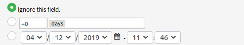

Administrator Interface
=======================

This package has no dedicated administrator interface, only extends the existing screens.

Generic Agent
-------------

This package extends the ticket actions of the *Generic Agent* module of the administrator interface. Dynamic fields of type date or date and time will be extended with the functionality to set absolute, relative or no date for the dynamic field.

To set relative dates:

1. Open the *Generic Agent* screen in administrator interface.
2. Expand the tab *Update / Add Ticket Attributes*.
3. Set relative dates for date or date and time dynamic fields.

   Date Field in Generic Agent Screen

The values can be positive like *+5 days* or negative like *-10 hours* based on the current time.
