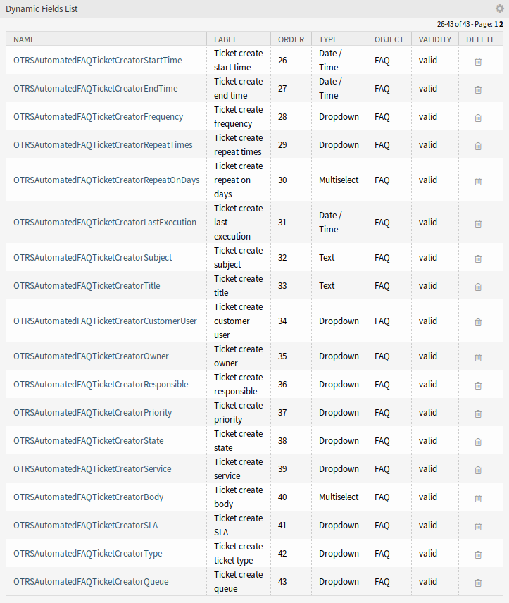
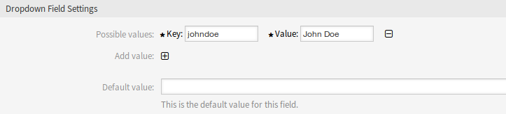
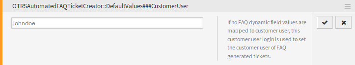
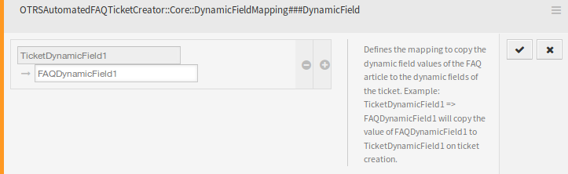
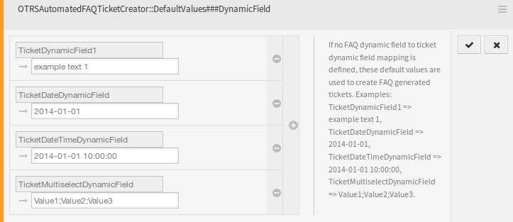

Dynamic Fields
==============

After installation of the package some new dynamic fields are added to the system. The dynamic field management screen is available in the *Dynamic Fields* module of the *Processes & Automation* group.

   Dynamic Field Management Screen

New Dynamic Fields
------------------

This packages provides new dynamic fields and an OTRS daemon cron job to create new tickets with configured values based on FAQ items.

``OTRSAutomatedFAQTicketCreatorStartTime``
   This dynamic field defines the start time for the ticket creation. This is a date/time field.

``OTRSAutomatedFAQTicketCreatorEndTime``
   This dynamic field defines the end time for the ticket creation. This is a date/time field.

``OTRSAutomatedFAQTicketCreatorFrequency``
   This dynamic field defines the frequency for the ticket creation. Possible values are: *Daily*, *Weekly*, *Monthly*, *Quarterly*, *Yearly*.

   To create a ticket for each month choose the frequency *Monthly*.	

``OTRSAutomatedFAQTicketCreatorRepeatTimes``	
   This dynamic field defines the repeat times for the ticket creation. Possible values are: 1-20.

   If you choose the frequency *Monthly* and a repeat time of *2* then the ticket will be created each second month: January, March, May, July, etc.

``OTRSAutomatedFAQTicketCreatorRepeatOnDays``
   This dynamic field defines the repeat on days for the ticket creation. Possible values are: *Sunday*, *Monday*, *Tuesday*, *Wednesday*, *Thursday*, *Friday*, *Saturday*.

   If you choose the frequency *Daily*, a repeat time of *2* and *Monday* to *Friday* as repeat on days then the ticket will be created each second day in the range between Monday to Friday: Monday, Wednesday Friday, Monday, etc.

``OTRSAutomatedFAQTicketCreatorLastExecution``
   This dynamic field defines the last execution time for the ticket creation. This is a date/time field.

``OTRSAutomatedFAQTicketCreatorSubject``
   This dynamic field defines the article subject for the ticket creation. Possible value is: *[Article title]*, for example: *This is the subject of the article*.

   .. seealso::

      To define a default value for this dynamic field, you can also set a value to the following system configuration option:

      - ``OTRSAutomatedFAQTicketCreator::DefaultValues###Subject``

``OTRSAutomatedFAQTicketCreatorTitle``
   This dynamic field defines the ticket title for the ticket creation. Possible value is: *[Ticket title]*, for example: *This is the title of the ticket*.

   .. seealso::

      To define a default value for this dynamic field, you can also set a value to the following system configuration option:

      - ``OTRSAutomatedFAQTicketCreator::DefaultValues###Title``

``OTRSAutomatedFAQTicketCreatorCustomerUser``
   This dynamic field defines the ticket customer user for the ticket creation. Possible values are: *[Customer user login] → [Customer user full name]*, for example: *customer-1 → John Doe*.

   .. seealso::

      To define a default value for this dynamic field, you can also set a value to the following system configuration option:

      - ``OTRSAutomatedFAQTicketCreator::DefaultValues###CustomerUser``

``OTRSAutomatedFAQTicketCreatorOwner``
   This dynamic field defines the ticket owner for the ticket creation. Possible values are: *[Owner user login] → [Owner full name]*, for example: *root@localhost → Admin OTRS*.

   .. seealso::

      To define a default value for this dynamic field, you can also set a value to the following system configuration option:

      - ``OTRSAutomatedFAQTicketCreator::DefaultValues###Owner``

``OTRSAutomatedFAQTicketCreatorResponsible``
   This dynamic field defines the ticket responsible for the ticket creation. Possible values are: *[Responsible user login] → [Responsible full name]*, for example: *root@localhost → Admin OTRS*.

   .. seealso::

      To define a default value for this dynamic field, you can also set a value to the following system configuration option:

      - ``OTRSAutomatedFAQTicketCreator::DefaultValues###Responsible``

``OTRSAutomatedFAQTicketCreatorPriority``
   This dynamic field defines the priority for the ticket creation. Possible values are: *[Priority Name] → [Priority Name]*, for example: *very low → 1 very low*.

   .. seealso::

      To define a default value for this dynamic field, you can also set a value to the following system configuration option:

      - ``OTRSAutomatedFAQTicketCreator::DefaultValues###Priority``

``OTRSAutomatedFAQTicketCreatorState``
   This dynamic field defines the ticket state for the ticket creation. Possible values are: *[State name] → [State name]*, for example: *pending reminder → pending reminder*.

   .. seealso::

      To define a default value for this dynamic field, you can also set a value to the following system configuration option:

      - ``OTRSAutomatedFAQTicketCreator::DefaultValues###State``

``OTRSAutomatedFAQTicketCreatorService``
   This dynamic field defines the ticket service for the ticket creation. Possible values are: *[Service name] → [Service name]*, for example: *1st Level Service → 1st Level Service*.

   .. seealso::

      To define a default value for this dynamic field, you can also set a value to the following system configuration option:

      - ``OTRSAutomatedFAQTicketCreator::DefaultValues###Service``

``OTRSAutomatedFAQTicketCreatorBody``
   This dynamic field defines the article body for the ticket creation. Possible values are: *[FAQ field index] → [FAQ field caption]*, for example: *1 → Symptom*.

   .. seealso::

      To define a default value for this dynamic field, you can also set a value to the following system configuration option:

      - ``OTRSAutomatedFAQTicketCreator::DefaultValues###Body``

``OTRSAutomatedFAQTicketCreatorSLA``
   This dynamic field defines the ticket SLA for the ticket creation. Possible values are: *[SLA name] → [SLA name]*, for example: *1st Level SLA → 1st Level SLA*.

   .. seealso::

      To define a default value for this dynamic field, you can also set a value to the following system configuration option:

      - ``OTRSAutomatedFAQTicketCreator::DefaultValues###SLA``

``OTRSAutomatedFAQTicketCreatorType``
   This dynamic field defines the ticket type for the ticket creation. Possible values are: *[Ticket type name] → [Ticket type name]*, for example: *Unclassified → Unclassified*.

   .. seealso::

      To define a default value for this dynamic field, you can also set a value to the following system configuration option:

      - ``OTRSAutomatedFAQTicketCreator::DefaultValues###Type``

``OTRSAutomatedFAQTicketCreatorQueue``
   This dynamic field defines the queue for the ticket creation. Possible values are: *[Queue name] → [Queue name]*, for example: *Raw → Raw*.

   .. seealso::

      To define a default value for this dynamic field, you can also set a value to the following system configuration option:

      - ``OTRSAutomatedFAQTicketCreator::DefaultValues###Queue``

To add new values:

1. Choose the dynamic field you would like to change the values for.
2. Add a new value in the *Field Settings* widget.
3. Click on the *Save* button to save the dynamic field.

System Configuration
--------------------

Use the following system configuration option to copy dynamic field values of the FAQ to the ticket:

- ``OTRSAutomatedFAQTicketCreator::Core::DynamicFieldMapping###DynamicField``

To define a default value for this dynamic field, you can also set a value to the following system configuration option:

- ``OTRSAutomatedFAQTicketCreator::DefaultValues###DynamicField``

Usage
-----

The following use case example will show how to edit and add a customer user.

To edit field values of a dynamic field:

1. Go to the *Dynamic Fields* module of the administrator interface.
2. Choose the dynamic field you like to change the values for.
3. Add a new value in the *Field Settings* widget.
4. Click on the *Save* or *Save and finish* button to save the dynamic field.

For example copy the login name, first name and last name of the customer user to the field.

   Edit Dynamic Field Value

To edit default field values of a dynamic field:

1. Go to *System Configuration* screen.
2. Select *OTRSAutomatedFAQTicketCreator* in the *Navigation* widget.
3. Navigate to *Core → OTRSAutomatedFAQTicketCreator → DefaultValues* in the navigation tree.
4. Add the default value for customer user to setting ``OTRSAutomatedFAQTicketCreator::DefaultValues###CustomerUser``.

   System Configuration – Default Value

To copy a field value of a FAQ dynamic field into the new ticket dynamic field:

1. Go to *System Configuration* screen.
2. Select *OTRSAutomatedFAQTicketCreator* in the *Navigation* widget.
3. Navigate to *Core → OTRSAutomatedFAQTicketCreator* in the navigation tree.
4. Search for setting ``OTRSAutomatedFAQTicketCreator::Core::DynamicFieldMapping###DynamicField``.
5. Set mapping for a dynamic field. You need to use the ticket field as key and the FAQ field as value.

   System Configuration – Copy Value

.. note::

   It is only possible to map dynamic fields of the same type.

To set default field values of a dynamic field for the ticket created dynamic fields:

1. Go to *System Configuration* screen.
2. Select *OTRSAutomatedFAQTicketCreator* in the *Navigation* widget.
3. Navigate to *Core → OTRSAutomatedFAQTicketCreator → DefaultValues* in the navigation tree.
4. Search for setting ``OTRSAutomatedFAQTicketCreator::DefaultValues###DynamicField``.
5. Set some default values, for example:

   - Text: ``ExampleTicketDynamicField1Text`` → *hallo*
   - Multiselect: ``ExampleTicketDynamicField1Multiselect`` → *Value1;Value2;Value3*
   - Date: ``ExampleTicketDynamicField1Date`` → *2014-03-03*
   - Date/Time: ``ExampleTicketDynamicField1DateTime`` → *2014-03-03 10:00:00*
   - Checkbox: ``ExampleTicketDynamicField1Checkbox`` → *1*

   System Configuration – Default Field Value
