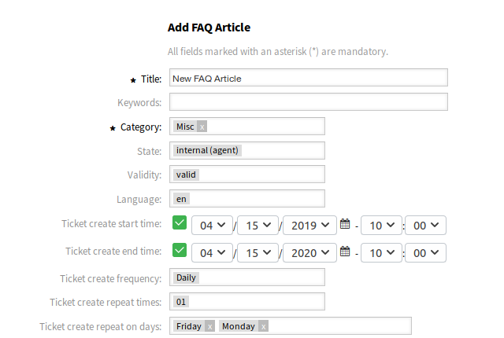

New
===

It is possible to define the ticket fields to be auto-populated and the ones that has to be filled manually.

By default only certain dynamic fields are shown in the FAQ creation and edit screens, those that controls the frequency of the ticket creation but not ones that set values for the ticket, instead the ticket uses the default values provided in the system configuration settings described in :doc:`../../admin/processes-automation/dynamic-fields` chapter of the administrator interface.

.. seealso::

   To show the dynamic fields that set ticket values:

   1. Go to *System Configuration* screen.
   2. Search for settings ``FAQ::Frontend::AgentFAQAdd###DynamicField`` and/or ``FAQ::Frontend::AgentFAQEdit###DynamicField``.
   3. Update their values from *0* to *1* as any other dynamic field.

Use Case Example
----------------

The following example assumes that all FAQ dynamic fields that set ticket values are activated for the FAQ add screen and the configuration of each dynamic field is set with valid values for the system.

To create a FAQ item which will be triggered for the ticket creation:

1. Create a new FAQ item.
2. Set *2019-04-15 10:00:00* for *Ticket create start time*.
3. Set *2020-04-15 10:00:00* for *Ticket create end time*.
4. Set *Daily* for *Ticket create frequency*.
5. Set *01* for *Ticket create repeat times*.
6. Select *Monday* and *Friday* for *Ticket create repeat on days*.
7. Fill the following fields to define the values for the ticket which will be created:

   - Ticket create customer user
   - Ticket create owner
   - Ticket create responsible
   - Ticket create ticket type
   - Ticket create queue
   - Ticket create priority
   - Ticket create service
   - Ticket create SLA
   - Ticket create state

   Create New FAQ Article

Now every Monday and Friday in the range of 2019-2020 years the OTRS daemon cron job will create a ticket for this FAQ item.
