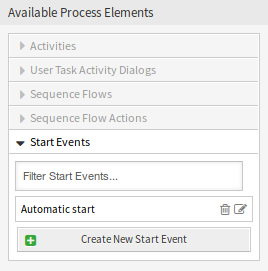
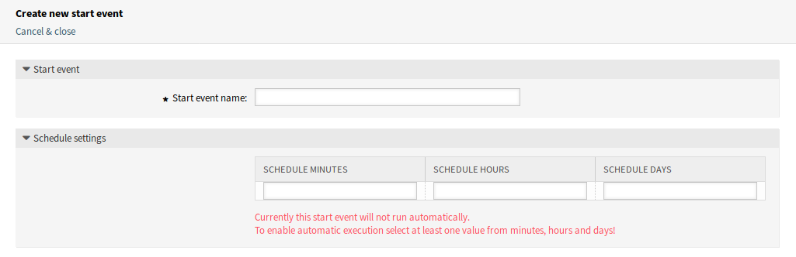
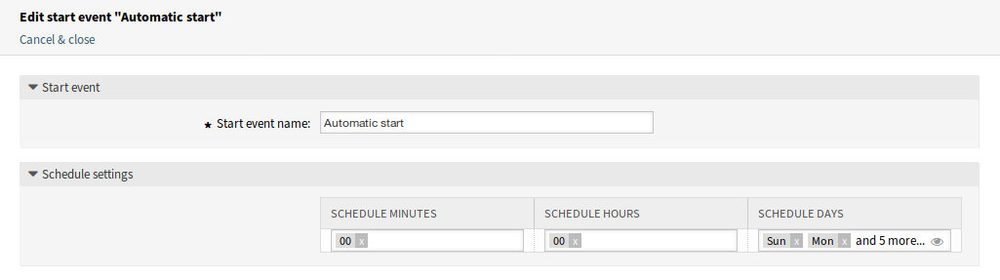
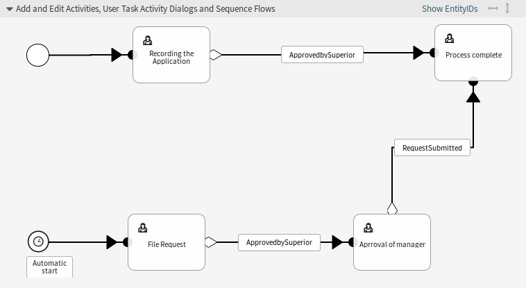

Process Management
==================

After installation of the package a new *Start Event* element will be available in the accordion widget of the process management. Processes can now contain a normal start point and a scheduled start point. The schedule of the start event can be configured via an interface.

Create Start Events
-------------------

To be able to create a start event for the process management, create a process or modify an existing one.

Click on the *Start Events* item in the *Available Process Elements* widget in the left sidebar. This action will expand the *Start Events* options and will collapse all others doing an accordion like effect. Click on the *Create New Start Event* button.

   Start Events

In the opened popup screen fill in the *Start Event Name* as well as set the schedule times.

   Create New Start Event Screen

Start event name
   A name of the scheduled based start point.

Schedule settings
   Cron settings of the scheduled start point.

To edit an already defined start event, just click on its name in the *Available Process Elements* widget.

   Edit Start Event Screen

Add Start Event to Canvas
-------------------------

To add a configured start event to the process canvas screen a free activity (not connected to other activities) is necessary. The scheduled based start event can not be connected directly to the normal start point of the process. In addition, the timer start event is not moveable. It is absolutely required to connect the scheduled based start event to a free activity. This first scheduled based activity can then be connected with a normal activity.

   Start Event on Canvas

The initial activity of the timer start event can be any type of activity. In case of a user task activity, the process ticket is created and the process stays in this activity.

.. note::

   Any change that is made on the process will require to re-deploy the process in order to get the change reflected in the system.
