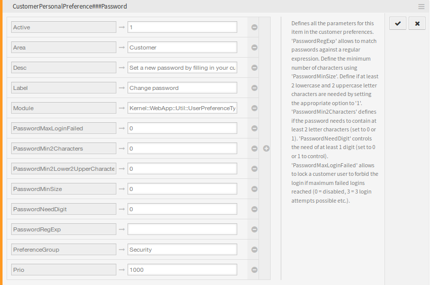

System Configuration
====================

The customer passwords can be restricted in the external interface to avoid using of week passwords.

To activate these features:

1. Go to *System Configuration* screen.
2. Select *OTRSBruteForceAttackProtection* in the *Navigation* widget.
3. Navigate to *Frontend → External → View → Preferences* in the navigation tree.
4. Modify the settings.
5. Deploy the modified settings.

   ``CustomerPersonalPreference###Password`` Setting

``PasswordMaxLoginFailed``
   Allows to lock a customer user to forbid the login if maximum failed logins reached. Setting this option to *0* disables the feature, setting the option to *3* means that only three login attempts possible.

   The OTRS log file contains an error message related to the locked customer user account and the forbidden login. This error message can be used by third-party tools like `fail2ban <https://www.fail2ban.org/>`__.

   .. code-block:: none

      [Mon Oct 15 15:57:03 2018][Error][Kernel::System::CustomerAuth::Auth][259] CustomerUser:
      Login for 'customer-1' is forbidden due to too many failed logins! (REMOTE_ADDR: 127.0.0.1)

``PasswordMin2Characters``
   Defines if the password needs to contain at least 2 letter characters by setting the option to *1*.

``PasswordMin2Lower2UpperCharacters``
   Defines if at least 2 lowercase and 2 uppercase letter characters are needed by setting the option to *1*.

``PasswordMinSize``
   Defines the minimum number of characters in passwords.

``PasswordNeedDigit``
   Defines if the password needs to contain at least 1 digit by setting the option to *1*.

``PasswordRegExp``
   Allows to match passwords against a regular expression.
