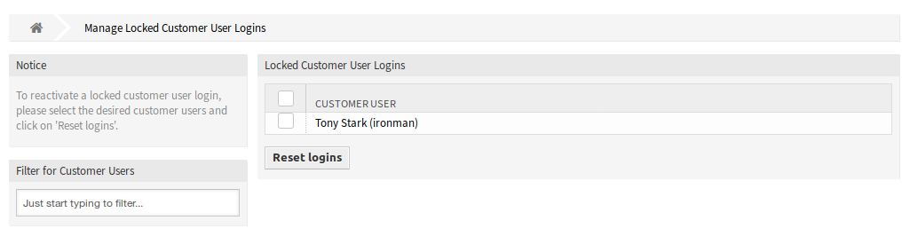

Customer Users (Locked)
=======================

Use this screen to review and reset the customer user logins. The locked customer user login management screen is available in the *Customer Users (Locked)* module of the *Users, Groups & Roles* group.

   Locked Customer User Logins Management Screen

Manage Locked Customer User Logins
----------------------------------

To reset a customer user login:

1. Select a customer user from the list.
2. Click on the *Reset logins* button.

Select the checkbox in the header of the table to reset all customer user logins.

.. note::

   If several customer users are locked, use the filter box to find a particular customer user by just typing the name to filter.
