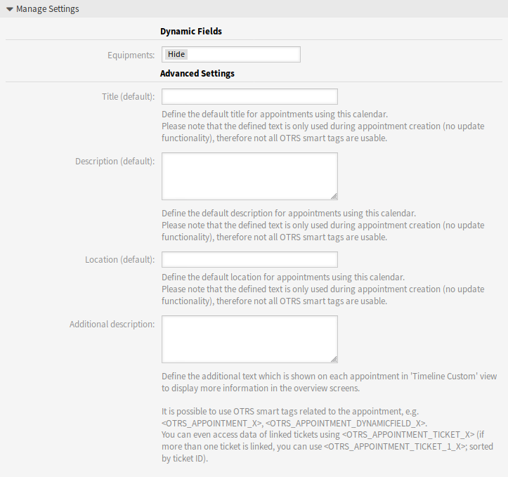

Calendars
=========

Use this screen to add default values to appointments. The calendar management screen is available in the *Calendars* module of the *Administration* group in the administrator interface or from the *Manage Calendars* menu item of the *Calendar* menu in the agent interface.

This package extends the *Calendar Management* screen with a new section to set default title, description and location for appointments.

To set default values for appointments:

1. Click on the *Add Calendar* button in the left sidebar or click on a calendar in the list of calendars.
2. Fill in the required fields.
3. Add default values in the *Manage Settings* widget.

   Manage Settings Widget

Manage Settings
---------------

The following settings are available when adding or editing this resource. The fields marked with an asterisk are mandatory.

Dynamic Fields
~~~~~~~~~~~~~~

.. note::

   This section is visible only, if :doc:`../processes-automation/dynamic-fields` for appointments are added to the system.

Each appointment dynamic fields are listed in this section.

Define for each appointment dynamic field to *Hide*, *Show* or *Show as mandatory*.

Advanced Settings
~~~~~~~~~~~~~~~~~

Title (default)
   Define the default title for appointments using this calendar.

Description (default)
   Define the default description for appointments using this calendar.

Location (default)
   Define the default location for appointments using this calendar.

Additional description
   Define the additional text which is shown on each appointment in *Timeline Custom* view to display more information in the overview screens. It is possible to show attributes of the appointments, as well as stored dynamic fields. Even the access to linked ticket data is possible.

It is possible to use OTRS smart tags related to the appointment, e.g. ``<OTRS_APPOINTMENT_X>``, ``<OTRS_APPOINTMENT_DYNAMICFIELD_X>``. You can even access data of linked tickets using ``<OTRS_APPOINTMENT_TICKET_X>``. If more than one ticket is linked, you can use ``<OTRS_APPOINTMENT_TICKET_1_X>``. Tickets are sorted by ticket ID.

.. note::

   The appointment is not created at this time and not all values are there (e.g. no dynamic field values can be used). The defined texts are only used during appointment creation (no update functionality), therefore not all OTRS smart tags are usable.

The default values are populated whenever the calendar is chosen and the title, description or location is empty. 

Behind the input fields for title, description and location, there is a refresh button if default values are specified. This refresh button could be used to re-apply the stored default values if for example dynamic fields are entered in the screen.

.. warning::

   The already entered data will be overwritten using the refresh buttons.
