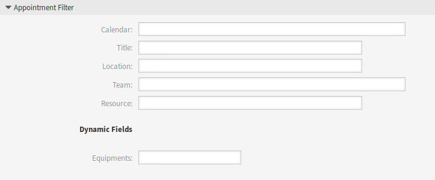

Appointment Notifications
=========================

Use this screen to filter appointments and send ICS files in appointment notifications, that can be opened with any regular calendar application. The appointment notification management screen is available in the *Appointment Notifications* module of the *Communication & Notifications* group.

Appointment Filter
------------------

Use this section in new or existing appointment notification to filter appointments.

   Appointment Filter Section

It is possible to filter based on calendar, title, location, team or resource, as well as dynamic fields (if dynamic field for appointments is created in :doc:`../processes-automation/dynamic-fields` screen).

Send ICS Files in Notifications
-------------------------------

It is possible to include an ICS file to the appointment notification sent to users.

To activate the sending of ICS files:

1. Create a new appointment notification or select an existing appointment notification.
2. In the *Events* widget select ``AppointmentCreate``, ``AppointmentUpdate`` or ``AppointmentDelete`` as event.
3. In the *Notification Methods* widget select *Send ICS file*.

You can even configure to use the additional shown information out of the *Timeline Custom* view (configurable per calendar) in the ICS file generation as well. Just activate the setting ``AppointmentCalendar::ICSFiles::UseAppointmentDescription`` to combine the regular description with the configured text.
