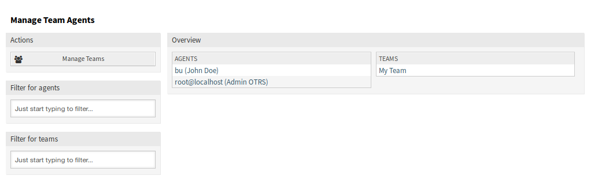
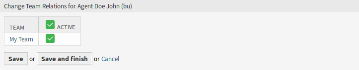
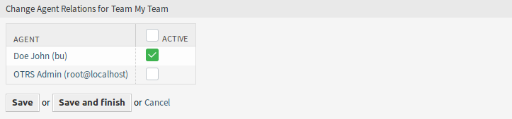

Manage Team Agents
==================

.. note::

   You have to be the member of ``admin`` group to access this screen.

Once you have set up a team in :doc:`manage-teams` screen, you must define which agents belong to which teams. To use this function, at least one agent and one team need to have been added to the system. The management screen is available in the *Manage Team Agents* menu item of the *Calendar* menu. Additionally, it is also accessible from the :doc:`resource-overview` and :doc:`manage-teams` screens.

   Manage Team Agents Screen

Manage Agents ↔ Teams Relations
-------------------------------

To assign some teams to an agent:

1. Click on an agent in the *Agents* column.
2. Select the teams you would like to assign the agent to.
3. Click on the *Save* or *Save and finish* button.

   Change Team Relations for Agent

To assign some agents to a team:

1. Click on a team in the *Teams* column.
2. Select the agents you would like to assign to the team.
3. Click on the *Save* or *Save and finish* button.

   Change Agent Relations for Team

.. note::

   If several agents or teams are added to the system, use the filter box to find a particular agent or team by just typing the name to filter.

Multiple agents or teams can be assigned in both screens at the same time. Additionally clicking on an agent or clicking on a team in the relations screen will open the *Edit Agent* screen or the *Edit Team* screen accordingly.

.. warning::

   Accessing an agent or a team provides no back link to the relations screen.
