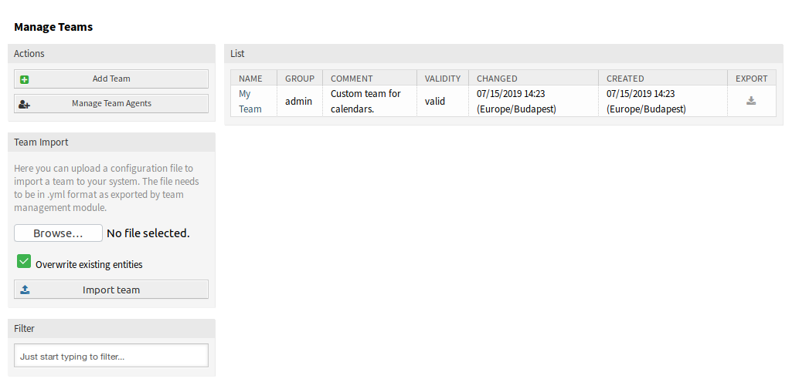
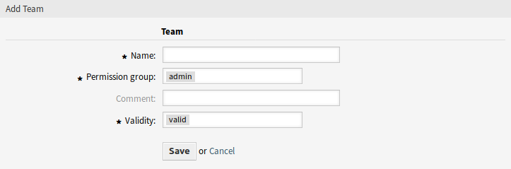
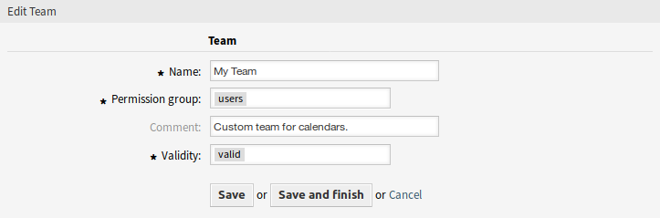
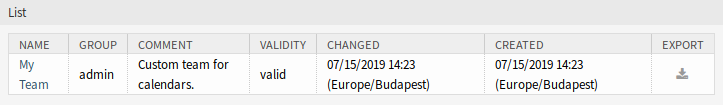
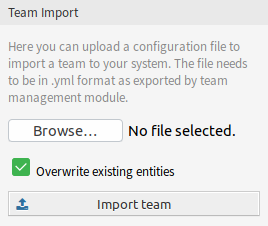

Manage Teams
============

.. note::

   You have to be the member of ``admin`` group to access this screen.

Use this screen to manage teams. The team management screen is available in the *Manage Teams* menu item of the *Calendar* menu. Additionally, it is also accessible from the :doc:`resource-overview` and :doc:`manage-team-agents` screens.

   Manage Teams Screen

Manage Teams
------------

To create a new team:

1. Click on the *Add Team* button in the left sidebar.
2. Fill in the required fields.
3. Click on the *Save* button.

   Add Team Screen

.. warning::

   Teams can not be deleted from the system. They can only be deactivated by setting the *Validity* option to *invalid* or *invalid-temporarily*.

To edit a team:

1. Click on a team in the list of teams.
2. Modify the fields.
3. Click on the *Save* or *Save and finish* button.

   Edit Team Screen

To manage team agents:

1. Click on the *Manage Team Agents* button.
2. Assign agents to teams and vice versa in the :doc:`manage-team-agents` screen.

To export a team:

1. Click on the export icon in the last column of the overview table.
2. Choose a location in your computer to save the ``Export_Team_Team_name.yml`` file.

   Export Team Screen

To import a team:

1. Click on the *Browse…* button of the *Team Import* widget in the left sidebar.
2. Select a previously exported ``.yml`` file.
3. Click on the *Overwrite existing entities* checkbox, if you would like to overwrite the existing teams.
4. Click on the *Import team* button.

   Team Import Widget

.. note::

   If several teams are added to the system, use the filter box to find a particular team by just typing the name to filter.

Team Settings
-------------

The following settings are available when adding or editing this resource. The fields marked with an asterisk are mandatory.

Name \*
   The name of this resource. Any type of characters can be entered to this field including uppercase letters and spaces. The name will be displayed in the overview table.

Permission group \*
   Agent groups that can manage the team. Full access to this group is required for anyone to be able to manage the team and its agents, as well as assign them as resources to appointments.

Comment
   Add additional information to this resource. It is recommended to always fill this field as a description of the resource with a full sentence for better clarity, because the comment will be also displayed in the overview table.

Validity \*
   Set the validity of this resource. Each resource can be used in OTRS only, if this field is set to *valid*. Setting this field to *invalid* or *invalid-temporarily* will disable the use of the resource.
