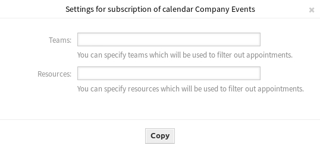

Resource Overview
=================

While it is possible to assign resources to an appointment in any calendar overview, this screen is designed exclusively for allocating resources to appointments. The resource overview screen is available in the *Resource Overview* menu item of the *Calendar* menu.

This screen looks very much like a regular calendar overview. It has a filter for teams on top and a list of agents for that team (available only in time-line views). By choosing a team from the top filter, you will be presented with all appointments assigned to it. A new button *Timeline Custom* is also added as a new customizable view.

.. figure:: images/calendar-resource-overview.png
   :alt: Resource Overview Screen

   Resource Overview Screen

Management screens for the *Resource Overview* screen:

- Click on the :doc:`manage-calendars` button to set up some calendars.
- Click on the :doc:`manage-teams` button to create teams.
- Click on the :doc:`manage-team-agents` button to assign agents to teams.
- Click on the *Add Appointment* button to create appointment in the configured calendars.

.. note::

   The buttons are available only, if calendars, teams and team agent are configured properly.

Once you have both teams and their agents set up, you can proceed to a calendar overview and start assigning appointments to teams and agents. Simply add or edit an appointment, and choose both team and agent from the lists under resource. You can do this via any calendar overview, as appointment edit dialog is the same for all of them.

By simply dragging an appointment to a row line with an agent’s name in time-line view, it is possible to assign an appointment to this resource. If an appointment does not have an agent assigned to it, it will appear in the *Unassigned* row of the screen. An appointment with multiple assigned agents will be displayed in each row of assigned agents. Dragging one instance of this appointment will move all them in the same fashion.

By editing settings of the resource overview via gear icon in top right corner, you can choose which team agents are displayed within the overview and you can customize the *Timeline Custom* view.

There is an other icon in the top right corner labeled with double arrow. Clicking on this icon makes the current view full screen and hides the left sidebar. If you click on the full screen icon again, the view is restored and the left sidebar will be visible. The full width mode is stored in the user preferences, so the full screen mode is remembered even after reloading the overview screens.

The *Timeline Custom* view with the extended settings dialog and the full screen mode is available also in the *Calendar Overview* screen.

In all other aspects, resource overview screen behaves in the same way as a regular calendar overview.

Timeline Custom Settings
------------------------

Some of these settings have been applied also to the regular calendar overview.

.. figure:: images/calendar-resource-overview-settings.png
   :alt: Calendar Settings Dialog

   Calendar Settings Dialog

The following settings are available when adding or editing this resource. The fields marked with an asterisk are mandatory.

Shown resources
   This setting is user and team specific, and if you have defined an agent filter in this way, a trash icon will be displayed on top of the list of agents so you can remove it easily.

Resource information
   Show additional resource information next to the agent name in the *Resource Overview* screen. You can use OTRS smart tags related to agents, e.g. ``<OTRS_AGENT_X>``. You can even access agent preferences.

   .. seealso::

      The additional resource information can be added in setting ``AppointmentCalendar::CustomTimeline::ResourceInformation`` in the system configuration.

Show weekends
   Select whether the weekends should be displayed or not.

Shown weeks
   Select how many weeks should be displayed in the *Timeline Custom* view. 

Start time
   Select the start time for the *Timeline Custom* view. The default *00:00* means the start time will be at the very beginning of the day (midnight).

End time
   Select the end time for the *Timeline Custom* view. The default *24:00* means the end time will be at the very end of the day (midnight).

Slot duration
   Select the time slot duration for the *Timeline Custom* view. The default *2 Hours* means that each shown time slot has the duration of two hours (e.g. 12 slots are shown for a day 00:00 - 24:00).

Slot width
   Select the time slot width for the *Timeline Custom* view. The default *100 Pixel* means that each shown time slot has a width of 100 pixel.

In *Timeline Custom* view, it is possible to show more information on each shown appointment. For this, you have to configure the setting *Additional Description* in the :doc:`../../admin/administration/calendars` screen.

Add Appointment
---------------

You can assign multiple teams and agents to a single appointment, but you must always choose a team first. Resulting list of agents is an aggregate of all selected teams, without any duplicates. Choosing an agent from the list is also optional, so you can leave an appointment assigned only to a team.

.. figure:: images/calendar-resource-overview-appointment.png
   :alt: Add Appointment Dialog

   Add Appointment Dialog

Calendar Subscriptions
----------------------

It is possible to use a filter in calendar subscription feature.

To use the calendar subscription feature:

1. Open the *Calendar Overview* or the *Resource Overview* screens.
2. Click on the gear icon next to a calendar in the *Calendars* widget in left sidebar.
3. Select the teams and resources you want to filter for.
4. Click on the *Copy* button. Now the URL is copied to the clipboard.
5. Go to your calendar application and paste the URL.

   Calendar Subscription Settings Dialog

The dialog is kept open after clicking on *Copy* button, to be able to change the selected teams and resources.
