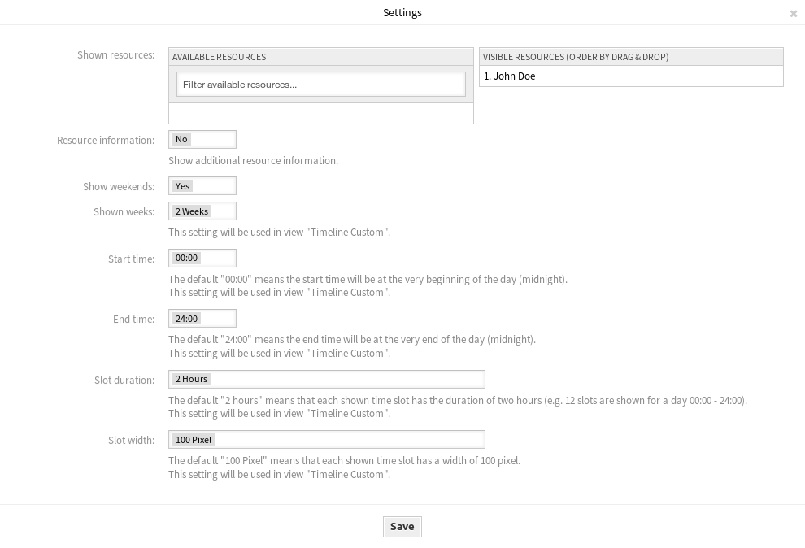

Resource Overview
=================

While it is possible to assign resources to an appointment in any calendar overview, this screen is designed exclusively for allocating resources to appointments. The resource overview screen is available in the *Resource Overview* menu item of the *Calendar* menu.

This screen looks very much like a regular calendar overview, except it has a filter for teams on top and a list of agents for that team (available only in time-line views). By choosing a team from the top filter, you will be presented with all appointments assigned to it.

.. figure:: images/calendar-resource-overview.png
   :alt: Resource Overview Screen

   Resource Overview Screen

Management screens for the *Resource Overview* screen:

- Click on the *Manage Calendars* button to set up some calendars.
- Click on the :doc:`manage-teams` button to create teams.
- Click on the :doc:`manage-team-agents` button to assign agents to teams.
- Click on the *Add Appointment* button to create appointment in the configured calendars.

.. note::

   The buttons are available only, if calendars, teams and team agent are configured properly.

Once you have both teams and their agents set up, you can proceed to a calendar overview and start assigning appointments to teams and agents. Simply add or edit an appointment, and choose both team and agent from the lists under resource. You can do this via any calendar overview, as appointment edit dialog is the same for all of them.

By simply dragging an appointment to a row line with an agent’s name in time-line view, it is possible to assign an appointment to this resource. If an appointment does not have an agent assigned to it, it will appear in the unassigned area of the screen. Appointment with multiple agents will be displayed as duplicated, but it most certainly is not. Dragging one instance of this appointment will move all them in the same fashion.

By editing settings of the resource overview via gear icon in top right corner, you can choose which team agents are displayed within the overview.

   Calendar Settings Dialog

This setting is user and team specific, and if you have defined an agent filter in this way, a trash icon will be displayed on top of the list of agents so you can remove it easily.

In all other aspects, resource overview screen behaves in the same way as a regular calendar overview.

Add Appointment
---------------

You can assign multiple teams and agents to a single appointment, but you must always choose a team first. Resulting list of agents is an aggregate of all selected teams, without any duplicates. Choosing an agent from the list is also optional, so you can leave an appointment assigned only to a team.

   Add Appointment Dialog
