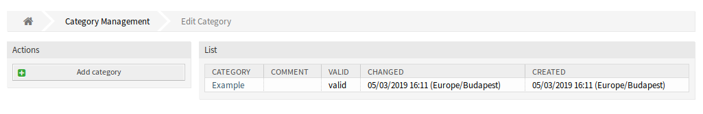
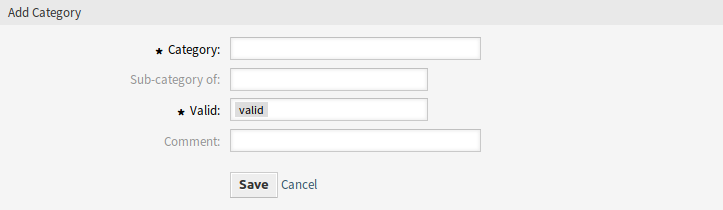
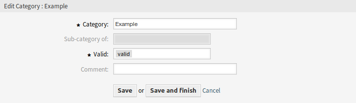

Categories
==========

Use this screen to add categories to the system. The category management screen is available in the *Categories* module of the *Ticket Settings* group.

   Category Management Screen

Manage Categories
-----------------

To add a category:

1. Click on the *Add category* button in the left sidebar.
2. Fill in the required fields.
3. Click on the *Save* button.

   Add Category Screen

.. warning::

   Categories can not be deleted from the system. They can only be deactivated by setting the *Validity* option to *invalid* or *invalid-temporarily*.

To edit a category:

1. Click on a category in the list of categories.
2. Modify the fields.
3. Click on the *Save* or *Save and finish* button.

   Edit Category Screen

Category Settings
-----------------

The following settings are available when adding or editing this resource. The fields marked with an asterisk are mandatory.

Category \*
   The name of this resource. Any type of characters can be entered to this field including uppercase letters and spaces. The name will be displayed in the overview table.

Sub-category of
   It is possible to add the new category under an existing one as sub-category. This will be displayed as *Parent Category::Child Category*.

Valid \*
   Set the validity of this resource. Each resource can be used in OTRS only, if this field is set to *valid*. Setting this field to *invalid* or *invalid-temporarily* will disable the use of the resource.

Comment
   Add additional information to this resource. It is recommended to always fill this field as a description of the resource with a full sentence for better clarity, because the comment will be also displayed in the overview table.
