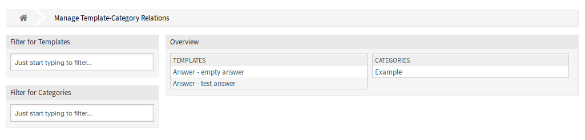
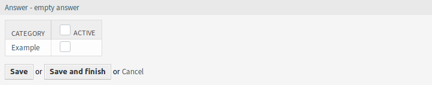
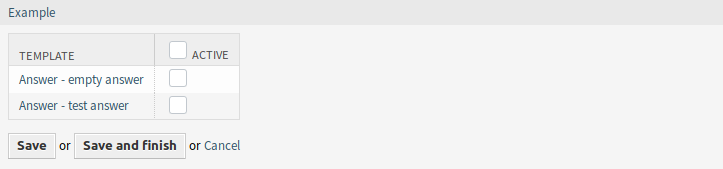

Templates ↔ Categories
======================

Use this screen to add one or more templates to one or more categories. To use this function, at least one template and one category need to have been added to the system. The management screen is available in the *Templates ↔ Categories* module of the *Ticket Settings* group.

   Manage Template-Category Relations Screen

Manage Templates ↔ Categories Relations
---------------------------------------

To assign a template to a category:

1. Click on a template in the *Templates* column.
2. Select the category you would like to add the template to.
3. Click on the *Save* or *Save and finish* button.

   Change category Relations for Template

To assign a category to a template:

1. Click on a category in the *Categories* column.
2. Select the templates you would like to assign the category to.
3. Click on the *Save* or *Save and finish* button.

   Change Template Relations for Category

.. note::

   If several templates or categories are added to the system, use the filter box to find a particular template or category by just typing the name to filter.

Multiple templates or categories can be assigned in both screens at the same time. Additionally clicking on a template or clicking on a category in the relations screen will open the *Edit Template* screen or the *Edit Category* screen accordingly.

.. warning::

   Accessing a category or a template provides no back link to the relations screen.
