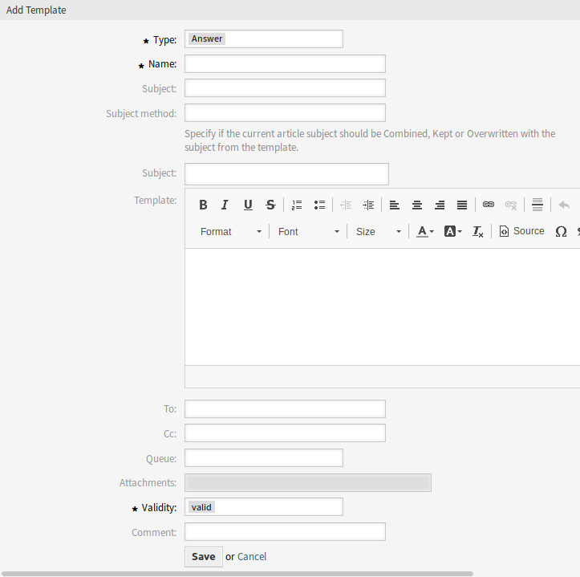

Templates
=========

The *Template Management* screen is extended with new fields. A template can now have to, cc and destination queue properties.

   Add Template Screen

New Fields
----------

To
   The person, to whom the ticket is created for. This will be the *To* field of the email.

Cc
   Other addresses as carbon copy of the email, if needed.

Bcc
   Other addresses as blind carbon copy of the email, if needed.
