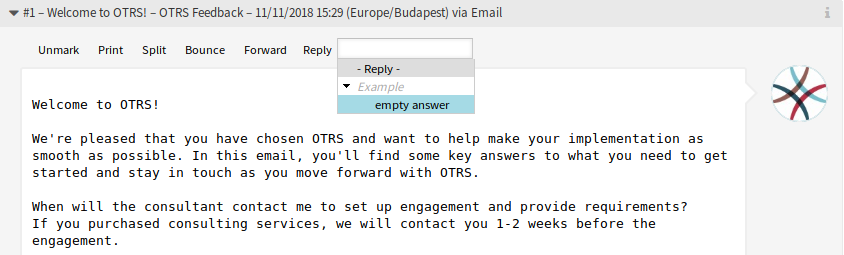

Ticket Zoom
===========

After installation of the package some new features are added to the *Ticket Zoom* screen.

Article Zoom
------------

   Article Zoom Widget

Reply
   Use this menu item to compose an answer to the article via email. Reply is created from a response template set in *Templates* module of the administrator interface.

   The menu item is extended with a tree view, so templates can be selected based on the defined categories.

Article Notification
--------------------

This package also adds the functionality to inform agents about updates on tickets they are currently working on.

If an agent opened the *Ticket Zoom* and started working on a ticket (adding an answer, a note, etc.), a pop-up is opened for this work. If the ticket is updated by another agent at this time, the agent will be informed by a dialog box in the pop-up. He has the possibility to close the pop-up without saving to view the updates on the tickets or to continue working within the pop-up without updating the ticket.

This functionality can be also activated in the main ticket zoom window by activating a setting in the system configuration.
