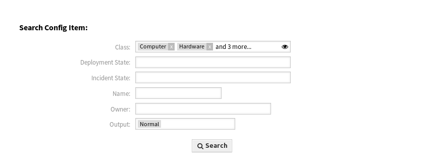

Search (Custom)
===============

Use this screen to search for configuration items with custom search.

   Search Config Item Dialog

To search for configuration items:

1. Click on the *Search (Custom)* menu item in the *CMDB* menu.
2. Select entries from the drop-down fields and add search terms in the text fields.
3. Select the output format.
4. Click on the *Search* button.
5. See the search result.

The search can be limited to specific configuration item classes. All classes are selected by default. Additionally, it is possible to limit the search by selecting the deployment and/or incident state.

The main use case is to search for configuration item owners across several configuration item classes. For example it is possible to find all configuration items of a specific owner during a change of an employee.

.. seealso::

   Additional search fields can be added in the system configuration in the :doc:`../../admin`.
