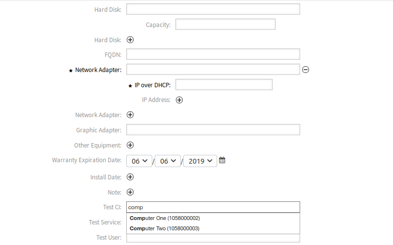

New
===

Use this screen to add new configuration items to the configuration management database.

To add a configuration item:

1. Select a class from the list of classes.
2. Fill in the required fields.
3. Search for a different configuration item, service or user to set the value for it.
4. Click on the *Save* button.

   Add Configuration Item To Class Computer

Now the value is automatically linked to the created configuration item.

.. seealso::

   The fields in the *Add Configuration Item* screen can be very different on each classes. The new fields added by this feature add-on is described in the :doc:`../../admin` chapter.
