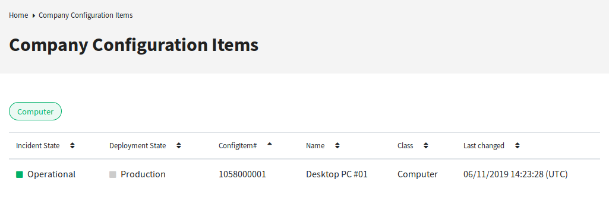
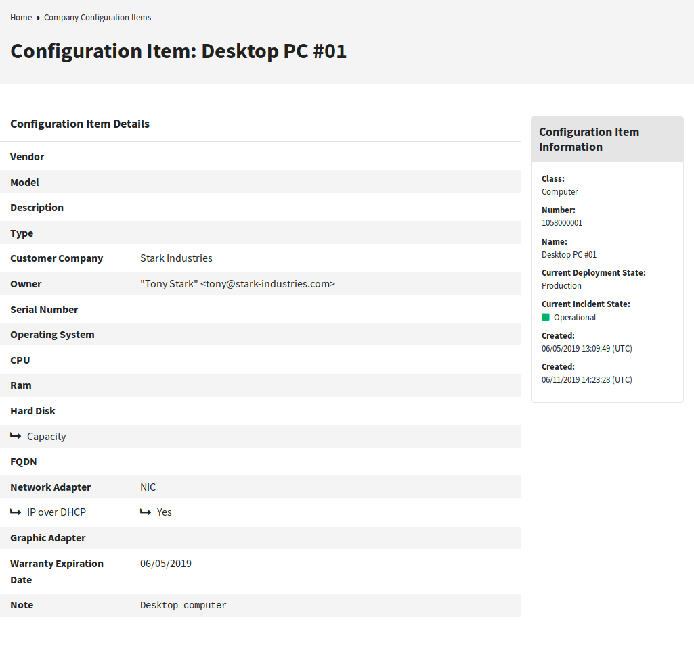

External Interface
==================

This feature makes it possible for a customer user to see and select the configuration items of his company in the external interface to link them to new tickets.

Link Configuration Item With Ticket
-----------------------------------

In the *New Ticket* screen the customer user can search and select the configuration items that are assigned to his company. When the ticket is created, the selected configuration items will be automatically linked to the new ticket.

To add a configuration to a new ticket:

1. Create a new ticket in the external interface.
2. Fill in the required fields.
3. Click on the *Add affected configuration items* button at the end of the ticket form. A new set of fields will appear below.
4. In the new section fill any search criteria for class, name or number.

   - *Class* drop-down list will only show classes that are already prepared and contains configuration items assigned to a ``CustomerID`` (for more information take a look at the :doc:`admin`).
   - *Name* field will match any configuration item which name starts with the content of the field. For example, if *ca* is typed in the field, it will match *cat*, *car*, *card*, etc.
   - *ConfigItem#* field will match any configuration item which number starts with the content of the field. For example, if *12* is typed in the field, it will match *123*, *1211*, *1298*, etc.

   .. note::

      This search fields will only reduce the search results in order to have smaller lists to be able to select faster. Leaving them in blank will bring the full list of configuration items assigned to the company of the current customer user.

5. Select the configuration items from the list.
6. Click on the *Create Ticket* button.

Company Configuration Items
---------------------------

A new screen *Company Configuration Items* shows a list of all configuration items that belong to the same company as the customer user. Belonging to the same company means, that the configuration items must
have a ``CustomerID`` field that has the same value as the customer user. In the external ticket detail view all linked configuration items that belong to the company of the customer user are
shown as well.

If desired, the required association of configuration items to the company of the customer user can be decreased by setting a maximum level to check linked configuration items. If this feature is enabled, configuration items are also accessible to customer users if they do not belong to the company directly, but a linked configuration item is (up to the configured number of links away).

The configuration item details can be access from the configuration items list. This details screen shows the last version of the configuration item, links to other configuration items (if
they belong to the same company).

.. seealso::

   This screen is not added to any menu of the external interface by default. To create a link to the *Company Configuration Items* screen, an administrator needs to add ``/itsmconfigitem/overview`` to the *Link* input field and add a name in the *Name* field in one of the following settings of the system configuration:

   - ``ExternalFrontend::Menu###Top``
   - ``ExternalFrontend::Menu###Main``
   - ``ExternalFrontend::Menu###Bottom``

   Company Configuration Items Screen

.. seealso::

   The visible columns can be defined in the following setting:

   - ``ExternalFrontend::ITSMConfigItemOverview###ShowColumns``

Clicking on a configuration item will show the detail view.

   Configuration Item Details Screen
