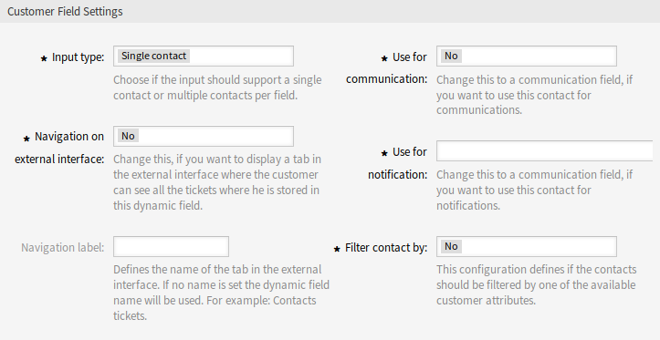

Dynamic Fields
==============

After installation of the package a new dynamic field type *Customer* will be available for the objects.

This dynamic field can be created the same way as default dynamic fields are created. For this navigate to the *Dynamic Fields* module of the *Processes & Automation* group in the administrator interface. In this screen you can select the *Customer* field from the drop-down lists on the left side.

.. seealso::

   The usage of dynamic fields and the general dynamic field settings are described in the `administrator manual <https://doc.otrs.com/doc/manual/admin/7.0/en/content/processes-automation/dynamic-fields.html>`__.

Dynamic Field Settings
----------------------

The following settings are available when adding or editing this resource. The fields marked with an asterisk are mandatory.

Customer Dynamic Field Settings
~~~~~~~~~~~~~~~~~~~~~~~~~~~~~~~

Customer dynamic field is used to store a customer user.

   Customer Dynamic Field Settings

Input type \*
   Defines whether the dynamic field should be able to store a *Single contact* or *Multiple contacts*.

Navigation on external interface \*
   Defines whether or not a new navigation entry in the external interface should be shown. This navigation entry will only be shown to customer users that are stored in one of the *Customer* fields. The label of this entry can be defined in the setting *Navigation label* if this setting is saved with *yes*.

Navigation label
   This configuration makes it possible to define a custom label for the navigation entry displayed in the external interface. If no value is configured, a default combination of the field label and *Tickets* will be used, for example *Contacts Tickets*.

Use for communication \*
   If customer users stored in a dynamic field of type *Customer* should get used for communication, this configuration has to be used. It is possible to use customer users for the *To*, *Cc* and *Bcc* field. If this configuration is active, the customer user will be added to the configured field. If the field is already containing the address of the customer user, it will not get added a second time. The agent still has the opportunity to remove the address from the field when composing a new message.

Use for notification \*
   If customer users stored in a dynamic field of type *Customer* should get used for notification, this configuration has to be used. It is possible to use customer users for the *To*, *Cc* and *Bcc* recipient. If this configuration is active, the dynamic field will be shown in the recipient block of the ticket notifications.

   .. note::

      If the configuration option ``UserForNotification`` is not set in the dynamic field table, the fallback recipient will be used. The fallback recipient is the *To* recipient.

Filter contact by \*
   In some scenarios it is necessary to filter possible contacts by their attributes. A filter for example could be the customer number, the city or a custom attribute. To activate the filter functionality, select the needed attribute from the drop-down list. If the customer number is selected, the contact will be filtered by the customer number of the customer of the ticket. For each other attribute the filter can be defined as a text value. After selecting the filter attribute from the drop-down list, a second input field will be displayed where the filter can be defined.

Filter criteria \*
   In this field the filter of the attributes for the customer result is defined. For example, if only customer users with the first name *Theo* should be selectable, the filter *Fistname* from the *Filter contact by* has to be selected. After that the *Filter criteria* field will be displayed. Now we can insert *Theo* into the filter field. Currently it is not possible to define a regular expression or a placeholder for filtering customer users.

.. note::

   Do not forget to add the new dynamic field to ticket view screens.

Add Dynamic Field to External Interface
---------------------------------------

After creating a dynamic field of type *Customer*, it has to be added to the screens, where it should get displayed.

To add the dynamic field to the external interface:

1. Go to *System Configuration* screen.
2. Select *All settings* in the *Navigation* widget.
3. Navigate to *Frontend → External → View → TicketDetailView* in the navigation tree.
4. Search for setting ``ExternalFrontend::TicketDetailView###DynamicField`` and click on the *Edit this setting* button.
5. Click on the *+* button to add the dynamic field. The key is the name of the dynamic field, the value is *1 - Enabled*. This setting is used to display the content of dynamic field in the ticket detail view.
6. Search for setting ``ExternalFrontend::TicketDetailView###FollowUpDynamicField`` and click on the *Edit this setting* button.
7. Click on the *+* button to add the dynamic field. The key is the name of the dynamic field, the value is *1 - Enabled*. This setting is used to configure dynamic fields in the answer part of customers detail view.
8. Repeat the steps for other views, if needed.
9. Deploy the modified settings.

If other packages are installed along with this package that override template names for certain modules, manual change of setting ``Frontend::Output::FilterElementPost###OTRSCustomContactFieldsJS`` is needed. Overridden template names will have to be added to the list of output filter configuration so it can work correctly.

For example, package ``OTRSCIsInCustomerFrontend`` overrides templates ``CustomerTicketMessage`` and ``CustomerTicketZoom`` with ``OTRSCIsInCustomerFrontendCustomerTicketMessage`` and ``OTRSCIsInCustomerFrontendCustomerTicketZoom`` respectively. These template names have to be added to the system configuration according to example below, in order for output filter to be activated.
