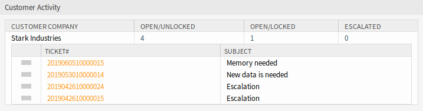
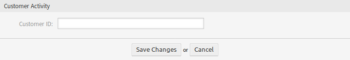

Dashboard
=========

Every agent can choose the customers he wants to see via configuration options of this dashboard widget. For the selected customers the number of open/unlocked, open/locked and escalated tickets will be shown.

   Customer Activity Widget

By clicking on the number of tickets a list of tickets will be shown. Click on a ticket to open the it in the *Ticket Zoom* screen.

To turn on and off the widget:

1. Expand the *Settings* widget in the right sidebar by clicking on its header bar.
2. Modify the checked state of the *Customer Activity* entry.
3. Click on the *Save settings* button.

To add customers to the widget:

1. Hover the mouse over the widget header.
2. Click on the gear icon in the top right corner.
3. Enter the customer ID of a customer into the text field.
4. Click on the *Save Changes* button.

   Customer Activity Widget - Add Customer

After entering and submitting a customer, an additional customer can be entered in the empty company field after re-opening the settings. So customers can be added one after another.

To remove a customer from the widget:

1. Hover the mouse over the widget header.
2. Click on the gear icon in the top right corner.
3. Click on the minus icon next to the text field.
4. Click on the *Save Changes* button.
