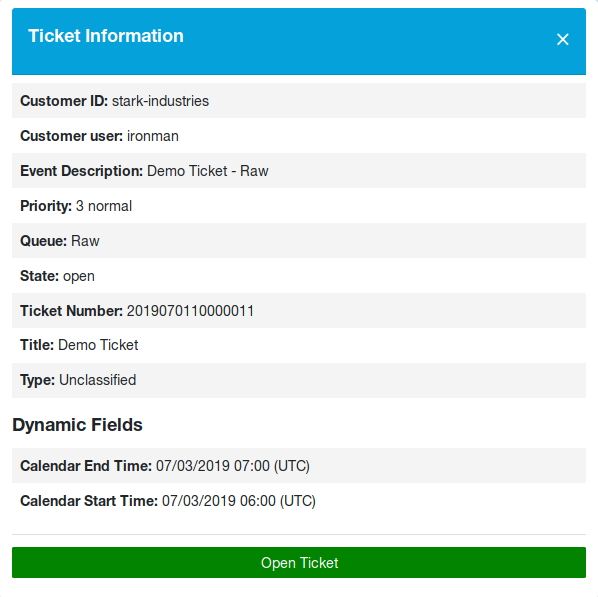

External Interface
==================

This package implements the *Event Ticket Calendar* for the external interface. If a ticket has dynamic fields contain date values, the ticket will be displayed in the calendar widget.

.. seealso::

   The calendar settings can be set in the system configuration in the :doc:`admin`.

When a new ticket is created for the customer user and the values are set in the dynamic fields for the start and end time, the calendar shows the event.

   Events Ticket Calendar Widget

Click on an entry to see the details of the ticket. An event information box will be displayed with the event items, that an agent has set for the ticket.

   Ticket Details Popover

Click on the *Open Ticket* button to open the ticket.

.. seealso::

   This screen is not added to any menu of the external interface by default. To create a link to the *Ticket Calendar* screen, an administrator needs to add ``/ticket/calendar`` to the *Link* input field and add a name in the *Name* field in one of the following settings of the system configuration:

   - ``ExternalFrontend::Menu###Top``
   - ``ExternalFrontend::Menu###Main``
   - ``ExternalFrontend::Menu###Bottom``
