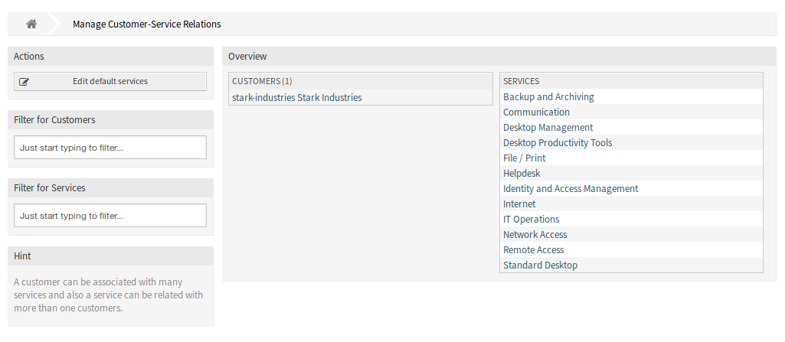
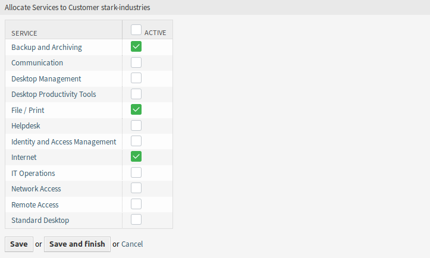
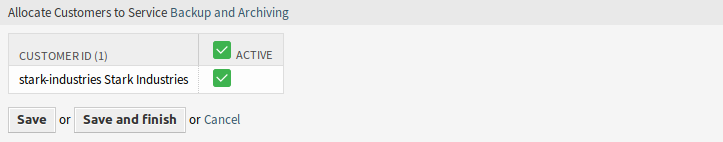
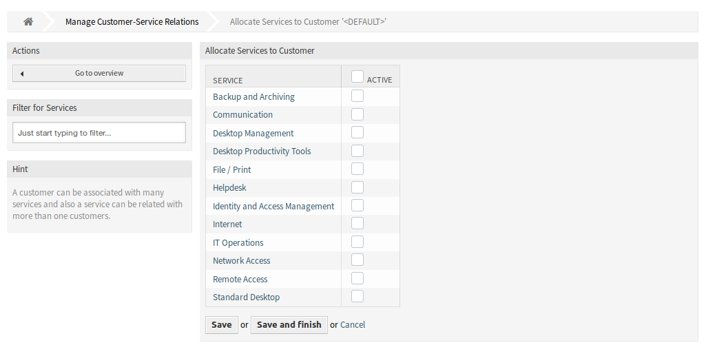

Customers ↔ Services
=====================

Use this screen to add one or more customers to one or more services. To use this function, at least one customer and one service need to have been added to the system. The management screen is available in the *Customers ↔ Services* module of the *Users, Groups & Roles* group.

   Manage Customer-Service Relations

Manage Customers ↔ Services Relations
--------------------------------------

To allocate some services to a customer:

1. Click on a customer in the *Customers* column.
2. Select the services you would like to allocate to the customer.
3. Click on the *Save* or *Save and finish* button.

   Change Service Relations for Customer

To allocate some customer to a service:

1. Click on a service in the *Services* column.
2. Select the customers you would like to allocate to the service.
3. Click on the *Save* or *Save and finish* button.

   Change Customer Relations for Service

.. note::

   If several customers or services are added to the system, use the search box to find a particular customer or use the filter box to find a particular service by just typing the name to filter.

Multiple customers or services can be assigned in both screens at the same time. Additionally clicking on a customer or clicking on a service in the relations screen will open the *Edit Customer* screen or the *Edit Service* screen accordingly.

.. warning::

   Accessing a customer or a service provides no back link to the relations screen.

.. note::

   By setting a checkbox in the header of a column will set all the checkboxes in the selected column.

.. note::

   The allocations of customer users and services should be done with this screen. It is not recommended to use the screen *Customer Users ↔ Services*.

Manage Default Services
-----------------------

It is possible to add default services, so that all customer users of the customer may access them. This prevents having to add each service to each customer.

To edit the default services:

1. Click on the *Edit default services* button in the left sidebar.
2. Select the services which should be selectable for all customer.
3. Click on the *Save* or *Save and finish* button.

   Allocate Services to Customer Screen

.. warning::

   Mixing default services and customer specific services can be confusing. If a customer has specific services assigned, then the default services will be not applied.
