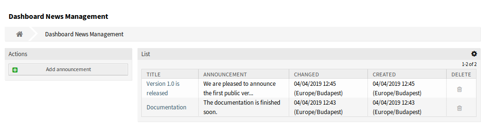
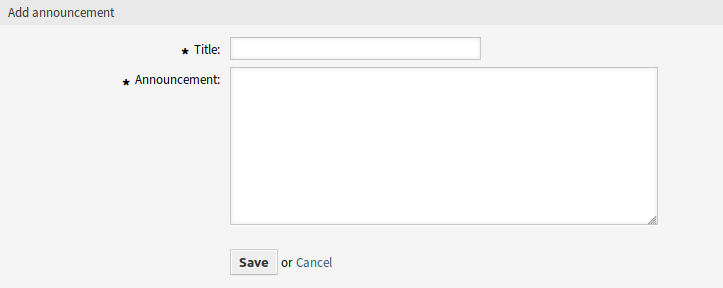
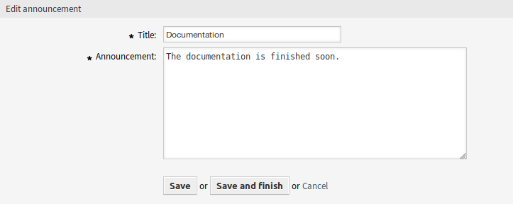
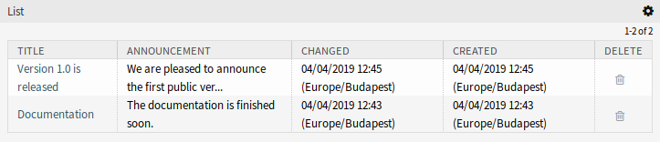
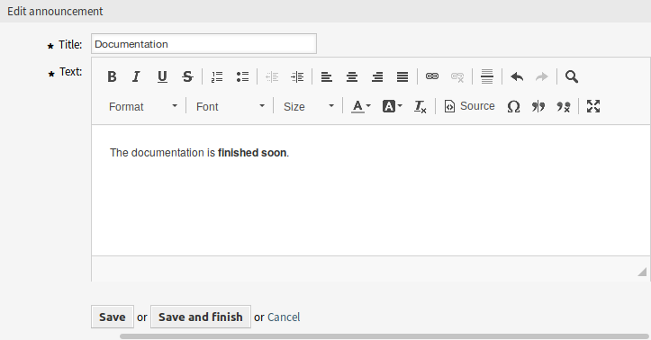

Dashboard News
==============

Use this screen to add announcements to agent dashboard. The announcement management screen is available in the *Dashboard News* module of the *Communication & Notifications* group.

   Dashboard News Management Screen

Manage Announcements
--------------------

To add an announcement:

1. Click on the *Add announcement* button in the left sidebar.
2. Fill in the required fields.
3. Click on the *Save* button.

   Add Announcement Screen

To edit an announcement:

1. Click on an announcement in the list of announcements.
2. Modify the fields.
3. Click on the *Save* or *Save and finish* button.

   Edit Announcement Screen

To delete an announcement:

1. Click on the trash icon in the list of announcements.
2. Click on the *OK* button in the confirmation dialog.

   Delete Announcement Screen

To limit the number of displayed announcements per page:

1. Click on the gear icon in the top right corner of the overview header.
2. Select the maximum number of announcements displayed per page.
3. Click on the *Submit* button.

Announcement Settings
---------------------

The following settings are available when adding or editing this resource. The fields marked with an asterisk are mandatory.

Title \*
   The title of the announcement. This will be displayed in the dashboard widget of the agent interface.

Announcement \*
   The body text of the announcement. This will be displayed in the overview screens and in the announcement details screen.

Rich Text editor can be enabled for the announcement text.

.. seealso::

   The ``DashboardNewsWidget::RichTextField`` setting needs to be enabled to use this feature.

   Edit Announcement Screen with Rich Text Editor

.. warning::

   If announcements were created using a Rich Text editor and the way to manage announcements was changed to normal text in the meantime, the content of the related announcements will be displayed with HTML tags and should be improved afterwards.
