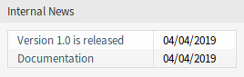
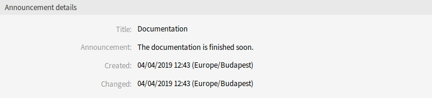
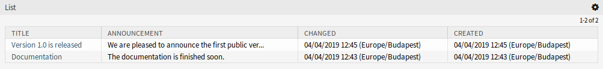

Dashboard
=========

After installation of the package a new widget will be displayed in the right sidebar of the agent dashboard.

   Internal News Widget

Clicking on an entry in the widget will open the *Announcement details* screen.

   Announcement Details Screen

There is a button to go back to the overview screen to see all announcements.

   Announcement Overview Screen

To limit the number of displayed announcements per page:

1. Click on the gear icon in the top right corner of the overview header.
2. Select the maximum number of announcements displayed per page.
3. Click on the *Submit* button.
