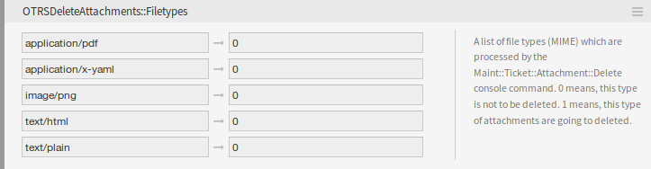

Administrator Interface
=======================

This package has no administrator interface.

System Configuration
--------------------

The package is not working out-of-the-box, it must be configured by an administrator first.

1. Go to the *System Configuration* screen.
2. Select *OTRSDeleteAttachments* in the *Navigation* widget.
3. Navigate to *Core → Ticket* in the navigation tree.
4. Add some file MIME types to setting ``OTRSDeleteAttachments::Filetypes`` as key-value pairs. The key is the MIME type, the value is the deletion flag.

   - 0: This type of attachments are not to be deleted.
   - 1: This type of attachments are going to deleted.

   File Types Setting

Automatic File Type Population
~~~~~~~~~~~~~~~~~~~~~~~~~~~~~~

There is a console command ``Maint::Ticket::Attachment::AddMIMETypes`` to populate the system configuration setting automatically.

.. code-block:: none

   otrs> /opt/otrs/bin/otrs.Console.pl Maint::Ticket::Attachment::AddMIMETypes
   Searching attachment types received the last 90 days...
   |       Added undefined MIME type: application/x-yaml
   |       Added undefined MIME type: image/png
   |       Added undefined MIME type: text/html
   |       Added undefined MIME type: application/pdf
   |       Added undefined MIME type: text/plain
   Updating SysConfig...
   Done.

.. note::

   The console command collects only MIME types of attachments, that are in closed tickets and received within the last 90 days.

Delete Attachments From Tickets
~~~~~~~~~~~~~~~~~~~~~~~~~~~~~~~

The attachment deletion is done by console command ``Maint::Ticket::Attachment::Delete``. Check the following settings to customize the job:

``OTRSDeleteAttachments::Queues``
   A list of queues (specified by their names) which are processed by the ``Maint::Ticket::Attachment::Delete`` console command.

   .. warning::

      If no queues are defined, all queues will be affected.

``OTRSDeleteAttachments::TimePeriod``
   The period (in days) which should be analyzed, starting from the time when the ticket was closed, backwards.

``OTRSDeleteAttachments::TimeSpan``
   The minimum time span (in days) between the current time and the time when the ticket was closed, to delete the attachments of a ticket.

With a ``TimeSpan`` value of *1* and ``TimePeriod`` value of *30* means that the eligible tickets to delete their attachments are the ones that has been closed between 30 days ago and yesterday.

.. code-block:: none

                      Eligible tickets
                |=========================|
            TimePeriod                TimeSpan
   |------------|------------|------------|------------|
   31 days ago  30 days ago  15 days ago  1 day ago    Today

.. seealso::

   The console command ``Maint::Ticket::Attachment::Delete`` has some other options. Run the command with the ``--help`` option to see the possibilities.

   .. code-block:: bash

      otrs> /opt/otrs/bin/otrs.Console.pl Maint::Ticket::Attachment::Delete --help

Automatic Execution
~~~~~~~~~~~~~~~~~~~

Updating the file types and deleting the attachments can be run in the background by the OTRS daemon. Enable the following settings to run the jobs in a regular basis:

``Daemon::SchedulerCronTaskManager::Task###OTRSDeleteAttachments``
   Delete attachments from tickets.

``Daemon::SchedulerCronTaskManager::Task###OTRSDeleteAttachments_AddMIMETypes``
   Populate system configuration MIME types for attachment deletion.

.. note::

   Do not forget to restart the OTRS daemon after the system configuration is changed.
