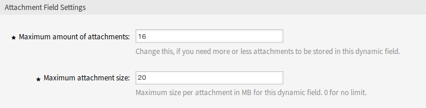

Dynamic Fields
==============

After installation of the package a new dynamic field type *Attachment* will be available for tickets and articles.

This dynamic field can be created the same way as default dynamic fields are created. For this navigate to the *Dynamic Fields* module of the *Processes & Automation* group in the administrator interface. In this screen you can select the *Attachment* field from the drop-down lists on the left side.

.. seealso::

   The usage of dynamic fields and the general dynamic field settings are described in the `administrator manual <https://doc.otrs.com/doc/manual/admin/7.0/en/content/processes-automation/dynamic-fields.html>`__.

Dynamic Field Settings
----------------------

The following settings are available when adding or editing this resource. The fields marked with an asterisk are mandatory.

Attachment Dynamic Field Settings
~~~~~~~~~~~~~~~~~~~~~~~~~~~~~~~~~

Attachment dynamic field is used to store attachments for tickets and articles.

Article dynamic fields can hold attachments for each ticket article. Attachments stored in an article dynamic field of type attachment can just be downloaded, but not deleted or changed.

Ticket dynamic fields can hold attachments for each ticket. Attachments stored in a ticket dynamic field of type attachment are stored once for each ticket and can be downloaded and deleted.

   Attachment Dynamic Field Settings

Maximum amount of attachments \*
   This setting holds the amount of files that can be stored in the dynamic field of type attachment per ticket or article. Increasing this value enables the agents to add more files. Reducing this amount does not delete attachments already stored in dynamic fields of type attachment, but reduces the possibility for adding files up to the configured maximum.

Maximum attachment size \*
   This setting holds the maximum file size in megabyte each uploaded file can have. If an agent is uploading a file greater than the here configured file size, the file is accepted initially. As soon as the upload is done, the size is checked and the file gets deleted as well as the user informed that the file was not stored because it exceeded the maximum attachment size limit.

.. note::

   Do not forget to add the new dynamic field to ticket view screens.
