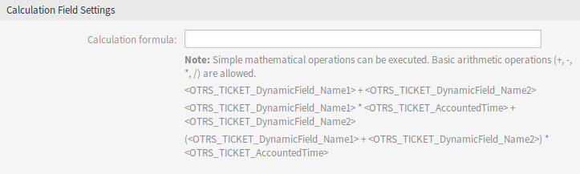

Dynamic Fields
==============

After installation of the package a new dynamic field type *Calculation* will be available for tickets and articles.

This dynamic field can be created the same way as default dynamic fields are created. For this navigate to the *Dynamic Fields* module of the *Processes & Automation* group in the administrator interface. In this screen you can select the *Calculation* field from the drop-down lists on the left side.

.. seealso::

   The usage of dynamic fields and the general dynamic field settings are described in the `administrator manual <https://doc.otrs.com/doc/manual/admin/7.0/en/content/processes-automation/dynamic-fields.html>`__.

Dynamic Field Settings
----------------------

The following settings are available when adding or editing this resource. The fields marked with an asterisk are mandatory.

Calculation Dynamic Field Settings
~~~~~~~~~~~~~~~~~~~~~~~~~~~~~~~~~~

Calculation dynamic field is used to perform simple mathematical operations.

   Calculation Dynamic Field Settings

Calculation formula
   This setting is used to add a calculation formula. Simple mathematical operations are possible. The default value is zero.

.. note::

   Do not forget to add the new dynamic field to ticket view screens.
