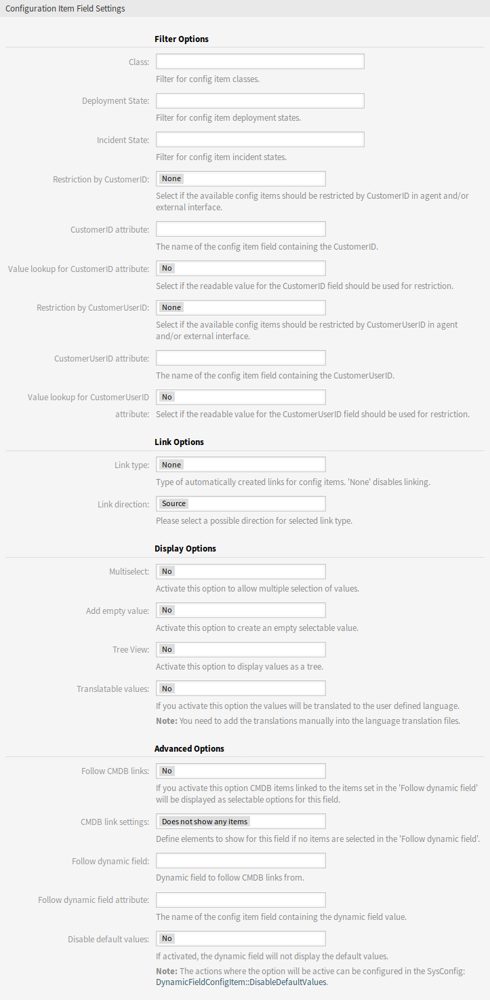

Dynamic Fields
==============

After installation of the package a new dynamic field type *Configuration item* will be available for tickets.

This dynamic field can be created the same way as default dynamic fields are created. For this navigate to the *Dynamic Fields* module of the *Processes & Automation* group in the administrator interface. In this screen you can select the *Configuration item* field from the drop-down lists on the left side.

.. seealso::

   The usage of dynamic fields and the general dynamic field settings are described in the `administrator manual <http://doc.otrs.com/doc/manual/admin/7.0/en/content/processes-automation/dynamic-fields.html>`__.

Dynamic Field Settings
----------------------

The following settings are available when adding or editing this resource. The fields marked with an asterisk are mandatory.

Configuration Item Dynamic Field Settings
~~~~~~~~~~~~~~~~~~~~~~~~~~~~~~~~~~~~~~~~~

Dynamic field of type configuration item is used to store configuration items for tickets.

   Configuration Item Dynamic Field Settings

Filter Options
^^^^^^^^^^^^^^

Class
   Filter for configuration item classes to narrow down the list of possible values.

Deployment State
   Filter for configuration item deployment states to narrow down the list of possible values.

Incident State
   Filter for configuration item incident states to narrow down the list of possible values.

Restriction by CustomerID
   Select if the available configuration items should be restricted by customer in agent and/or external interface.

CustomerID attribute
   The name of the configuration item field containing the customer. Usually this is the owner field.

Value lookup for CustomerID attribute
   Select if the readable value for the customer ID field should be used for restriction. Select this if the values of attribute are defined by a general catalog class.

Restriction by CustomerUserID
   Select if the available configuration items should be restricted by customer user in agent and/or external interface.

CustomerUserID attribute
   The name of the configuration item field containing the customer user. Usually this is the owner field.

Value lookup for CustomerUserID attribute
   Select if the readable value for the customer user ID field should be used for restriction. Select this if the values of attribute are defined by a general catalog class.

.. note::

   If the filters are changed after the configuration item and the ticket has been linked, the link will not be automatically updated.

Link Options
^^^^^^^^^^^^

Link type
   Type of automatically created links for configuration items. *None* disables the automatic linking.

Link direction
   If a *Link type* is selected, choose the link direction from the point of ticket.

Display Options
^^^^^^^^^^^^^^^

Multiselect
   Activate this option to allow multiple selection of values.

Add empty value
   Activate this option to create an empty selectable value.

Tree View
   Activate this option to display values as a tree.

Translatable values
   If you activate this option the values will be translated to the user defined language.

   .. note::

      You need to add the translations manually into the language translation files.

Advanced Options
^^^^^^^^^^^^^^^^

Follow CMDB links
   If you activate this option CMDB items linked to the items set in the *Follow dynamic field* will be displayed as selectable options for this field.

CMDB link settings
   Define elements to show for this field if no items are selected in the *Follow dynamic field*. Possible values:

   - Does not show any items
   - Show regular items

Follow dynamic field
   Dynamic field to follow CMDB links from. This option only works if the setting *Restriction by CustomerID* or *Restriction by CustomerUserID* is deactivated.

Follow dynamic field attribute
   The name of the configuration item field containing the dynamic field value.

Disable default values
   If activated, the dynamic field will not display the default values.

   .. seealso::

      The actions where the option will be active can be configured in the following system configuration setting:

      - ``DynamicFieldConfigItem::DisableDefaultValues``

.. note::

   Do not forget to add the new dynamic field to ticket view screens.
