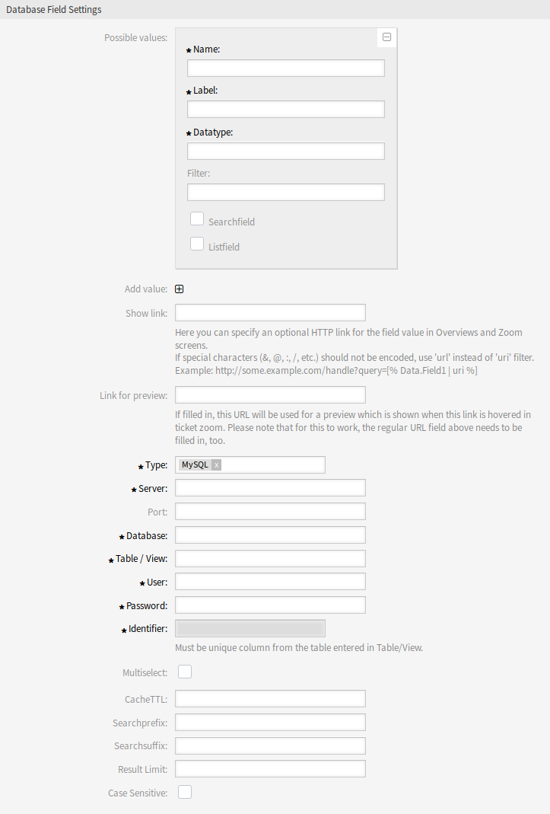

Dynamic Fields
==============

After installation of the package a new dynamic field type *Database* will be available for tickets.

This dynamic field can be created the same way as default dynamic fields are created. For this navigate to the *Dynamic Fields* module of the *Processes & Automation* group in the administrator interface. In this screen you can select the *Configuration item* field from the drop-down lists on the left side.

.. seealso::

   The usage of dynamic fields and the general dynamic field settings are described in the `administrator manual <http://doc.otrs.com/doc/manual/admin/7.0/en/content/processes-automation/dynamic-fields.html>`__.

Dynamic Field Settings
----------------------

Before an external database can be searched and the results be saved at the ticket through the dynamic field, the credentials have to be stored in the configuration of the dynamic field.

The following settings are available when adding or editing this resource. The fields marked with an asterisk are mandatory.

Database Dynamic Field Settings
~~~~~~~~~~~~~~~~~~~~~~~~~~~~~~~

Dynamic field of type database is used to store database records for tickets.

   Database Dynamic Field Settings

Possible values
   The possible values will fill up the *Identifier* field below automatically, which defines the value that will be stored in the dynamic field. Possible values can be created as much as needed (or at least as many table columns as the database table has). The possible values defines the database columns to search in. It is possible to set the column name, a description (label) the field should have, the needed data type and if the field should be a search or list field.

   Name \*
      The exact name of the database column which will be requested through the database queries.

   Label \*
      The label of the field which will be displayed in the detailed search.

   Datatype \*
      The data type which will be stored in the dynamic field. Possible values: *Date*, *Integer* or *Text*.

   Filter
      With the filter field, it is possible to choose a ticket attribute or a dynamic field as a filter for the related column. If the dynamic field is bound to a related ticket, the attributes will be used for the filter mechanism, otherwise the filters will be ignored. If filter will be configured to a table column, only search results matching to the search term and the related ticket attribute on exactly the configured column will be displayed.

   Searchfield
      Indicates if a field should be included in the search requests.

   Listfield
      Indicates if a field should be displayed in the results.

Add value
   Click on the + icon to add a new section to *Possible values*.

Show link
   Here you can specify an optional HTTP link for the field value in ticket overviews and zoom screens. If special characters (&, @, :, /, etc.) should not be encoded, use ``url`` instead of ``uri`` filter.

Link for preview
   If filled in, this URL will be used for a preview which is shown when this link is hovered in ticket zoom. Please note that for this to work, the regular URL field above needs to be filled in, too.

Type \*
   The type of the desired database can be selected here. The default OTRS database types are supported: MySQL, Oracle, PostgreSQL or MSSQL.

SID
   This option is only available for Oracle connections and will be shown or hidden automatically. Within this option you have to enter the SID of your Oracle connection.

Driver
   This option is only available for ODBC connections and will be shown or hidden automatically. Within this option you have to enter in the host system previously configured ODBC driver to connect to the desired MSSQL database.

Server \*
   The database host (host name or IP address).

Port
   The port of the database server.

Database \*
   Defines the desired target database of the DBMS. This database will be used for queries.

Table/View \*
   This table or view will be used for the queries.

User \*
   The username for the database connection.

Password \*
   The user password for the database connection.

Identifier \*
   This select box will be automatically filled through *Possible values*. This field represents the value which will be stored in the dynamic field. Must be unique column from the table entered in *Table/View*.

Multiselect
   If this field is selected, it will be possible to store more than one value to the dynamic field. Those values will be stored comma separated.

CacheTTL
   This value defines the period of validity of the database cache in seconds. Equal queries to the database will be answered through the cache (local file system) within this period instead of asking the database again.

Searchprefix
   This value will be put in the front of every search term while using the auto-completion to search the database. Wildcard characters are supported as well. The search prefix will be ignored during the detailed search, but it is still possible to use wildcard characters in those masks.

Searchsuffix
   This value will be put in the end of every search term while using the auto-completion to search the database. Wildcard characters are supported as well. The search suffix will be ignored during the detailed search, but it is still possible to use wildcard characters in those masks.

Result Limit
   The entered integer value defines the maximum amount of allowed results during a database search. This includes the auto-completion search as well as the detailed search.

Case Sensitive
   If this field is selected, case-sensitivity will take effect on searches.

.. note::

   Do not forget to add the new dynamic field to ticket view screens.

Storage of Historical Data
--------------------------

This module offers a functionality to store historical data. For this to work it is necessary to activate and set the settings in the system configuration available in *Core → DynamicFieldDatabase* navigation path.

In the configuration option for the ``SourceDynamicField`` it is needed to fill in the already created dynamic field name, which will be used to gather the historical data. In the related option ``TargetDynamicField`` the key have to be filled with the table columns of the connected external database, which will be readout. For every column the related target dynamic field has to be configured in the field content. The gathered data will be saved in these dynamic fields.

If the configuration is ready and active, the configured fields will be readout from the external database, since the source field gets a new value via the configured masks. The data will be searched by its stored identifier via an event module and the found values will be stored in the target dynamic fields.
