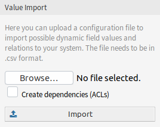
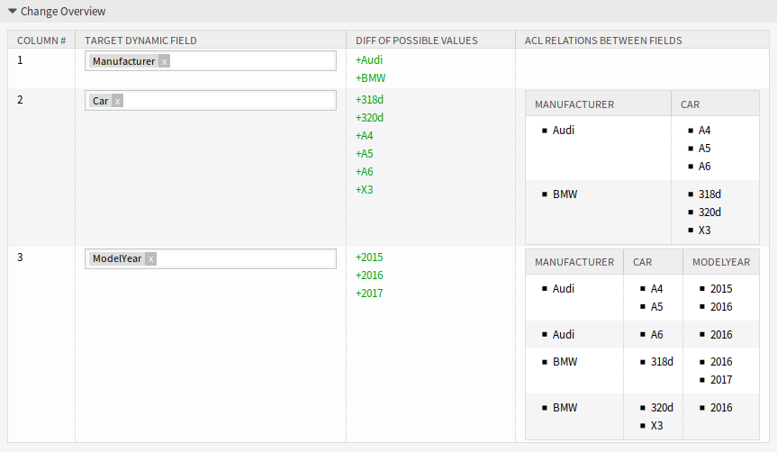
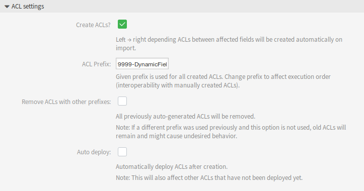
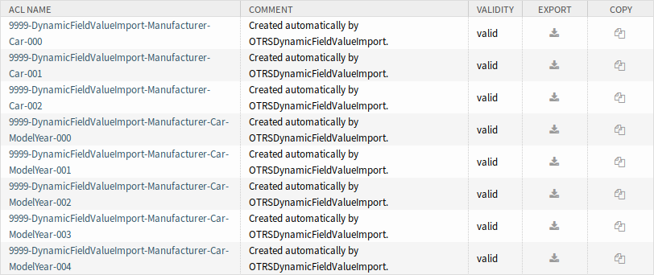

Dynamic Fields
==============

After installation of the package a new widget *Value Import* will be available in the left sidebar of the *Dynamic Fields Management* screen.

   Value Import Widget

To import values for a dynamic field:

1. Make sure that the target dynamic fields are already created.
2. Click on the *Browse…* button of the *Value Import* widget in the left sidebar.
3. Select a proper formatted ``.csv`` file.
4. Select the *Create dependencies (ACLs)* checkbox.
5. Click on the *Import* button.
6. Select the target dynamic fields and see the change difference.
7. Modify the ACL settings, if needed.
8. Click on the *Submit* button.

Example Usage
-------------

Target dynamic fields have to be created manually before they can be used for value import. Only select-type fields are allowed (drop-down and multiselect).

Create the following dynamic fields:

+--------+-------------+------------------+--------------+-----------------+
| Object | Type        | Name             | Label        | Possible values |
+========+=============+==================+==============+=================+
| Ticket | Multiselect | ``Manufacturer`` | Manufacturer | Leave it empty  |
+--------+-------------+------------------+--------------+-----------------+
| Ticket | Multiselect | ``Car``          | Car          | Leave it empty  |
+--------+-------------+------------------+--------------+-----------------+
| Ticket | Multiselect | ``ModelYear``    | Model Year   | Leave it empty  |
+--------+-------------+------------------+--------------+-----------------+

To guarantee a proper working of the feature provided by this package, please format your CSV files according to the example. The first line containing dynamic field names is optional, but the dynamic fields will be auto-selected in the next screen, if they are provided.

By default the separator defined in your language will be used (usually ``,`` or ``;``). Alternatively you can override this by using the CSV separator user preference.

.. code-block:: none

   Manufacturer,Car,ModelYear
   BMW,X3,2016
   BMW,318d,2016
   BMW,318d,2017
   BMW,320d,2016
   Audi,A4,2015
   Audi,A4,2016
   Audi,A5,2015
   Audi,A5,2016
   Audi,A6,2016

The CSV file contains information about possible values for dynamic fields. The first header line contains the target dynamic field names.

Browse for the CSV file and check the *Create dependencies (ACLs)* box if you want to generate ACLs. Click on the *Import* button, a new screen will be opened.

   Change Overview Widget

In this overview you will see a table indicating CSV column, the selected target dynamic field, a colorized change difference between old and new possible values and (if ACL setting is enabled) a preview of the relations between the fields. This helps comparing the data before the values are written.

Data from every CSV column will be assigned to a specific dynamic field. The target field can be chosen. If a header line is used, the field names are pre-selected.

.. warning::

   The existing possible values for all affected fields will be completely overwritten with the uploaded values. Therefore you should carefully check if the indication of removed and new values for each dynamic field matches your expectation. In order to retain existing values they need to be contained in the uploaded CSV file.

It is possible to automatically create left → right associated ACLs based on the selected dynamic fields and their imported values. This will reduce the effort to creating ACLs manually. The dependencies between dynamic fields and values are created from the left to right side.

   ACL Settings Widget

The following settings are available when using this functionality.

Create ACLs?
   If you want to generate ACLs, check this box. Left → right depending ACLs between affected fields will be created automatically on import.

ACL Prefix
   Given prefix is used for all created ACLs. Change prefix to affect execution order (interoperability with manually created ACLs).

Remove ACLs with other prefixes
   Select this checkbox, if all previously auto-generated ACLs should be removed.

   .. note::

      If a different prefix was used previously and this option is not used, old ACLs will remain and might cause undesired behavior.

Auto deploy
   Select this checkbox, if you would like to automatically deploy ACLs after creation.

   .. note::

      This will also affect other ACLs that have not been deployed yet.

The ACL creation is implemented in the following way:

- If the dynamic field with the value(s) from the left side is matched, it is (only) possible to select the dynamic field with the value(s) from the right side.
- If values for more than two dynamic fields are imported (3 or more columns exist in the CSV file), ACL relations are always created starting from the leftmost column. This allows for multi-level dependencies.

After you have finished all checks, just submit the form. The values of the affected dynamic fields will be updated in the background and, if activated, the ACLs will be generated. Afterwards you will be redirected to the dynamic field overview again.

Now go to the *ACL Management* screen, and check the generated ACLs.

   Generated ACLs for Dynamic Field Restrictions

Limitations
-----------

However this package makes it easy to import values for dynamic fields and generate the appropriate ACLs, there are some limitations.

- Dynamic field creation and configuration has to be done manually (e.g. to define if a field should be a drop-down or multiselect and if empty values are allowed).
- ACLs are created in a way that secondary fields require a selection on their primary field before any selection is possible.
- ACLs will always be created for all dynamic fields from the CSV file. Unrelated dynamic fields have to be imported separately.
