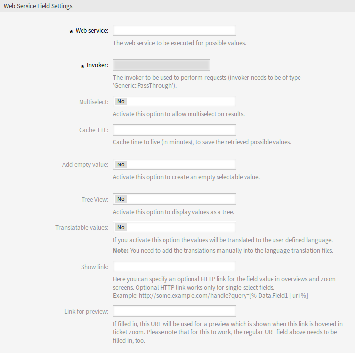

Dynamic Fields
==============

After installation of the package a new dynamic field type *Web Service* will be available for tickets.

This dynamic field can be created the same way as default dynamic fields are created. For this navigate to the *Dynamic Fields* module of the *Processes & Automation* group in the administrator interface. In this screen you can select the *Configuration item* field from the drop-down lists on the left side.

.. seealso::

   The usage of dynamic fields and the general dynamic field settings are described in the `administrator manual <http://doc.otrs.com/doc/manual/admin/7.0/en/content/processes-automation/dynamic-fields.html>`__.

Dynamic Field Settings
----------------------

It is necessary to have an already working web service before creating a new dynamic field, that uses such web services.

The following settings are available when adding or editing this resource. The fields marked with an asterisk are mandatory.

Web Service Dynamic Field Settings
~~~~~~~~~~~~~~~~~~~~~~~~~~~~~~~~~~

Dynamic field of type web service is used to store data from external systems for tickets.

   Web Service Dynamic Field Settings

Web service \*
   The configured web service whose invokers will be to triggered when a dynamic field is displayed.

Invoker \*
   The invoker that is used to send requests to external systems. Within this field, just invokers of type ``Generic::PassThrough`` will be displayed.

Multiselect
   A drop-down menu to determine if the displayed dynamic field should act as a multi-select field instead of a drop-down field.

Cache TTL
   A cache time to live value, that contains a value (in minutes). If the value is 0 or empty, no caching will be active. This cache is to prevent unnecessary requests to the remote server using the same values.

Add empty value
   Defines if it is possible to save an empty value in the field.

Tree View
   This option activates the tree view of possible values, if they are supplied in the correct format.

Translatable values
   If you activate this option the values will be translated to the user defined language.

   .. note::

      You need to add the translations manually into the language translation files.

Show link
   Here you can specify an optional HTTP link for the field value in overviews and zoom screens. Optional HTTP link works only for single-select fields. Example:

   .. code-block:: none

      http://some.example.com/handle?query=[% Data.Field1 | uri %]

   If special characters (&, @, :, /, etc.) should not be encoded, use ``url`` instead of ``uri`` filter.

Link for preview
   If filled in, this URL will be used for a preview which is shown when this link is hovered in ticket zoom. Please note that for this to work, the regular URL field above needs to be filled in, too.

.. note::

   Do not forget to add the new dynamic field to ticket view screens.

