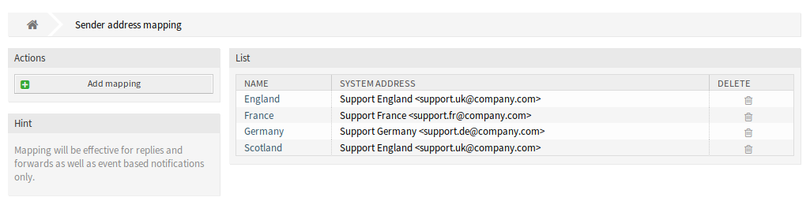
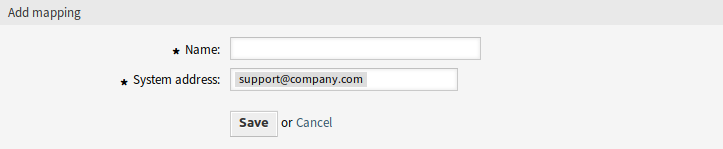
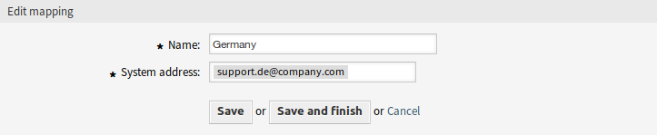
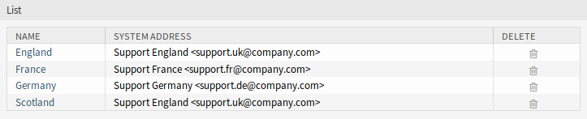

Sender Address Mapping
======================

Use this screen to map the values contained in the configured dynamic field into system email addresses. The sender address mapping screen is available in the *Sender Address Mapping* module of the *Communication & Notifications* group.

   Sender Address Mapping Management Screen

Map Email Addresses
-------------------

.. note::

   The mapping is based on the dynamic field set in setting ``DynamicSenderAddresses###FieldName``. The dynamic field has to be created manually.

To add a mapping:

1. Click on the *Add Mapping* button in the left sidebar.
2. Fill in the required fields.
3. Click on the *Save* button.

   Add Mapping Screen

To edit a mapping:

1. Click on a mapping in the list of mappings.
2. Modify the fields.
3. Click on the *Save* or *Save and finish* button.

   Edit Mapping Screen

To delete a mapping:

1. Click on the trash icon in the list of mappings.
2. Click on the *Confirm* button.

   Delete Mapping Screen

.. seealso::

   This administration screen reads and writes the system configuration setting ``DynamicSenderAddresses###Mapping``, where the key is the name of the mapping and the value is the internal ID of the system email address.

   .. figure:: images/dynamic-sender-addresses-mappings.png
      :alt: ``DynamicSenderAddresses###Mapping`` Setting

      ``DynamicSenderAddresses###Mapping`` Setting

.. warning::

   Do not change the setting manually. Use the administrator interface module instead. 

Mapping Settings
----------------

The following settings are available when adding or editing this resource. The fields marked with an asterisk are mandatory.

Name \*
   The name of this resource. Any type of characters can be entered to this field including uppercase letters and spaces. The name will be displayed in the overview table.

System address \*
   Select a system email address configured in *Email Addresses* module in the administrator interface.
