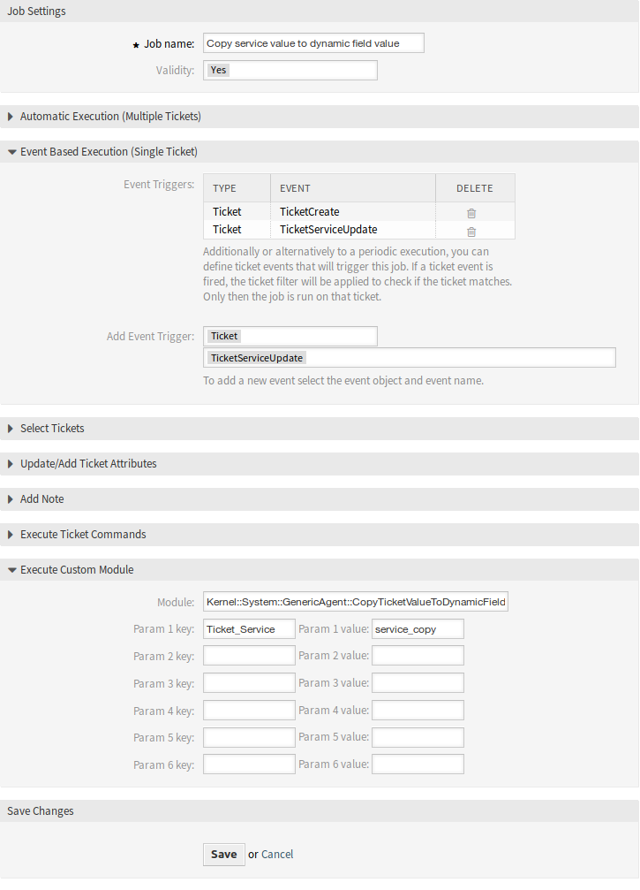

Generic Agent
=============

The ticket service should be the base for the sender address, but only dynamic field values are supported by this feature.

In order to allow using the service, create a new dynamic field and use a generic agent job. The helper module will be added in order to automatically fill the new dynamic field with the service name.

To fill the dynamic field value with the service name:

1. Create the dynamic field *Service Copy*, but do not configure for display on any ticket screen.

   - Object type: Ticket
   - Field type: Text
   - Name: ``service_copy``
   - Label: *Service Copy*

2. Create a generic agent job.

   - *Event Based Execution* section: Set the events ``TicketCreate`` and ``TicketServiceUpdate`` as triggers.
   - *Select Tickets* section: Set filters if the field should not be set globally (e. g. restricting this to specific queues).
   - *Execute Custom Module* section:

      - Module: ``Kernel::System::GenericAgent::CopyTicketValueToDynamicField``
      - Param 1 key: ``Ticket_Service``
      - Param 1 value: ``service_copy``

      Module parameters control which fields should be copied. The key determines the ticket attribute (service, queue, etc.) and the value determines the name of the destination dynamic field.

      .. note::

         ``Ticket_`` prefix is needed if ``Services`` is used as parameter key. It will be included on the values for setting new values on ticket and it is not possible to get a real value for it, then as consequence the value for this ticket field will be empty.

3. Mapping from dynamic field values can now be used to link service names to actual sender addresses.

   Generic Agent Configuration Example
