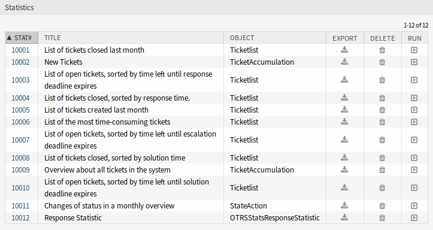
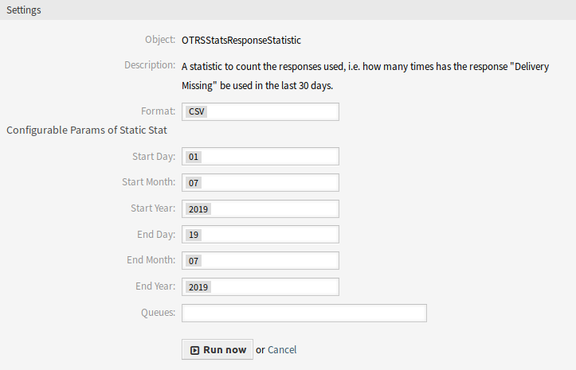

Statistics
==========

After installation of the package, a new statistics and two new dynamic list objects will be available in the *Statistics* screen.

New Statistic
-------------

After installation of the package, a new statistics will be available in the *Statistics* widget.

   Statistics Overview Screen

Response Statistic
   This static type statistic makes it possible to count how many times a response template has been used on a time frame. The result can be filtered by a time period and by queues.

To use the new statistic:

1. Search for *Response Statistic* in the *Statistics* widget.
2. Click on the *Run now* icon in the last column.
3. Select the time frame and the queues to include in the statistic.
4. Generate your statistic.

   Response Statistic Settings

New Dynamic Objects
-------------------

After installation of the package, two new dynamic object will be added to the system.

Statistics for Queue Resting Time
~~~~~~~~~~~~~~~~~~~~~~~~~~~~~~~~~

You are able to calculate the resting time of tickets for queues with this statistic module. The statistic considering also the close times of tickets. This accounted time will not added to the resting time or the resting time based on working period. The resting time based on working periods will be only displayed if you have configured calendars for your queues.

Available columns are:

- Number: numeration of the ticket list.
- Ticket#: ticket number.
- Ticket ID: internal ID of ticket.
- Created: ticket creation date.
- Changed: last change date of the ticket.
- Closed: last close date of the ticket.
- Status: current state of the ticket.
- Type: current type of the ticket.
- Queue: current queue based of the history entries.
- Queue join time: date based on history entries (ticket created in this queue, moved into this queue while being open or reopened in this queue).
- Queue left time: date based on history entries (ticket closed in this queue or moved out of this queue while being open). Empty if ticket was still open and in this queue at end of reporting time-frame.
- Resting time (seconds): count of the duration when the ticket stayed in the queue, based on join and left time. Times in which a ticket was closed will not be counted.
- Resting time (HH::MM:SS): count of the duration when the ticket stayed in the queue, formatted as hours, minutes and seconds.
- Resting time (Working hours, seconds): count of the duration when the ticket stayed in the queue based on the queue configured working calendars in the system configuration (this field will be empty if no calendar is configured).
- Resting time (Working hours, HH:MM:SS): formatted count of the duration when the ticket stayed in the queue based on the queue configured working calendars in the system configuration (this field will be empty if no calendar is configured).
- Criticality: current criticality of the ticket.
- Impact: current impact of the ticket.

To use the new dynamic object:

1. Create a new *Dynamic List* statistic.
2. Choose the dynamic object ``OTRSStatsQueueRestingTime``.
3. Configure the rest of the configuration options according to your wishes.
4. Run the statistic with output print or CSV.
5. All tickets matching the restrictions will be shown. Additional tickets will be shown, if the were created before the beginning of the reported and were still open during the reporting time frame.

Statistics for Queue Working Time
~~~~~~~~~~~~~~~~~~~~~~~~~~~~~~~~~

This statistic is a modified ticket list to calculate the display the working time per queue. This modified ticket list statistic contains 3 new columns for the X-axis. In general the time for the 3 new columns is calculated on the time where ticket was not in a closed, removed or merged state type.

Example queue *Misc*:

- Queue *Misc* time contains the time the agent have worked on the ticket.
- Queue *Misc* working time contains the time the agent have worked on the ticket based on the working calendars of the queue *Misc*.
- Queue *Misc* effective time contains the time the agent set as time units for the ticket while it was in the queue *Misc*. The values are displayed for each agent by first and last name in the same column (comma separated).

To use the new dynamic object:

1. Create a new *Dynamic List* statistic.
2. Choose the dynamic object ``OTRSStatsQueueWorkingTime``.
3. Click on the *X-axis* button and select the columns for the queue you like to display the working time or time.
4. Set all other restrictions and sort options you need for the statistic to complete the configuration.
5. Generate your statistic.
