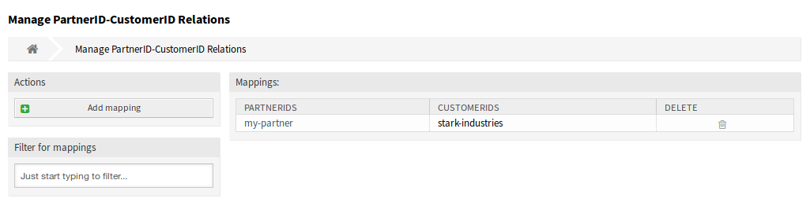
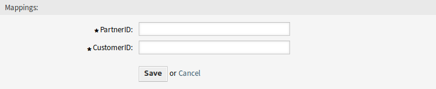
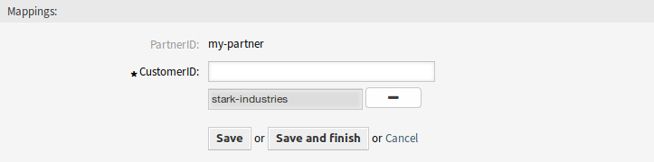
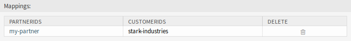

PartnerID ↔ CustomerID
======================

Use this screen to manage mappings between partners and customers. The management screen is available in the *PartnerID ↔ CustomerID* module of the *Miscellaneous* group.

   Manage PartnerID-CustomerID Relations Screen

Manage PartnerID ↔ CustomerID Relations
---------------------------------------

.. note::

   It is necessary to setup the LDAP server configuration in the system configuration.

To setup the LDAP server configuration:

1. Go to *System Configuration* screen.
2. Select *OTRSRestrictCustomerDataView* in the *Navigation* widget.
3. Navigate to *Core → LDAP* in the navigation tree.
4. Set the parameters for the LDAP connection.

If the LDAP server can be reached, the ``customer_id`` relations to the ``partner_id`` which is pulled from the LDAP server, will be stored in the database tables which are configured in
the ``PartnerIDMapping`` section within the system configuration.

To see the ``PartnerIDMapping`` settings:

1. Go to *System Configuration* screen.
2. Select *OTRSRestrictCustomerDataView* in the *Navigation* widget.
3. Navigate to *Core → PartnerIDMapping* in the navigation tree.
4. See the settings.

Following the relations stored in the mapping tables, access to data of certain customers is restricted for agents which have a partner ID and relations in the database. Those agents can only see customers witch have customer IDs that are allowed in the database.

If a partner ID of an agent is stored in the database, but no related customer IDs are assigned, the agent wont be able to see any customer information. Agents with no given partner ID will still be able to see every customer data.

If the LDAP server configuration and the partner ID mapping is properly set, you can proceed with the management screen.

To create a new mapping:

1. Click on the *Add mapping* button in the left sidebar.
2. Add a partner ID into the first field.
3. Add a customer into the second field. Just start typing, the field has auto-completion support. The added customer IDs will be displayed below the text field.
4. Click on the *Save* button.

   Add Mapping Screen

To edit a mapping:

1. Click on a mapping in the list of mappings.
2. Add or remove customers.
3. Click on the *Save* or *Save and finish* button.

   Edit Mapping Screen

The *PartnerID* field is read-only. If you would like to edit the partner ID, you can delete the mapping and create a new one with the other partner ID.

To delete a mapping:

1. Click on the trash icon in the last column of the overview table.
2. Click on the *OK* button in the confirmation dialog.

   Delete Mapping Screen

.. note::

   If several mappings are added to the system, use the filter box to find a particular mapping by just typing the name to filter.

Mapping Settings
----------------

The following settings are available when adding or editing this resource. The fields marked with an asterisk are mandatory.

PartnerID \*
   The ID of a partner as stored in the LDAP.

CustomerID \*
   The internal ID of a customer as stored in the OTRS database.
