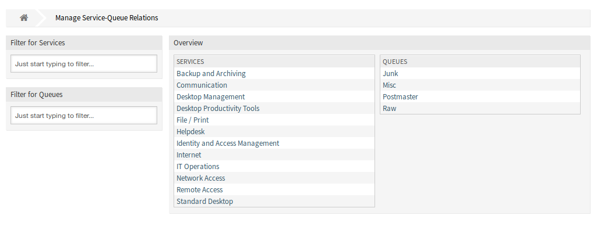
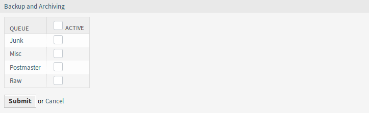
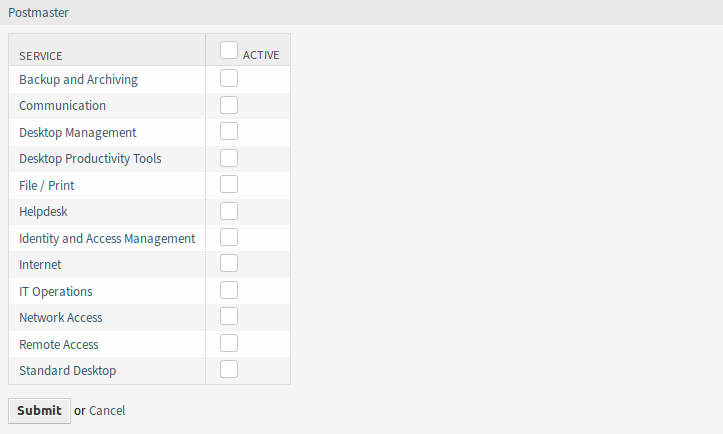

Services ↔ Queues
=================

Use this screen to add one or more services to one or more queues. To use this function, at least one service and one queue need to have been added to the system. The management screen is available in the *Services ↔ Queues* module of the *Ticket Settings* group.

   Manage Service-Queue Relations Screen

Manage Services ↔ Queues Relations
----------------------------------

To assign a service to a queue:

1. Click on a service in the *Services* column.
2. Select the queues you would like to add the service to.
3. Click on the *Save* or *Save and finish* button.

   Change Queue Relations for Service

To assign a queue to a service:

1. Click on a queue in the *Queues* column.
2. Select the services you would like to assign the queue to.
3. Click on the *Save* or *Save and finish* button.

   Change Service Relations for Queue

.. note::

   If several services or queues are added to the system, use the filter box to find a particular service or queue by just typing the name to filter.

Multiple services or queues can be assigned in both screens at the same time. Additionally clicking on a service or clicking on a queue in the relations screen will open the *Edit Service* screen or the *Edit Queue* screen accordingly.

.. warning::

   Accessing a queue or a service provides no back link to the relations screen.
