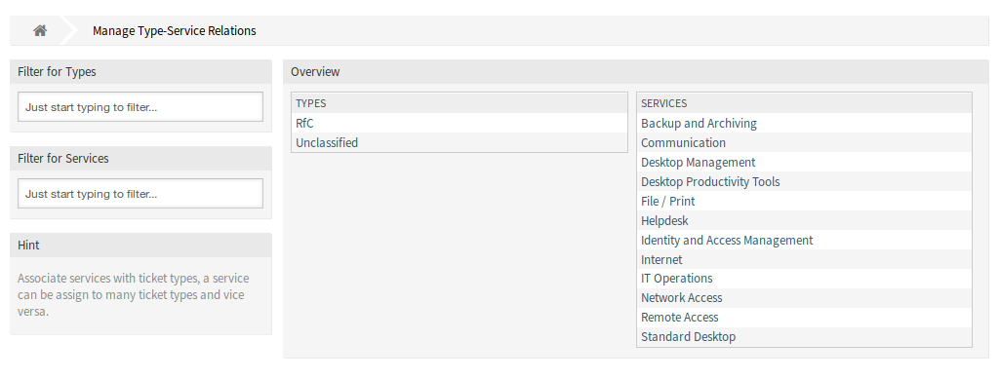
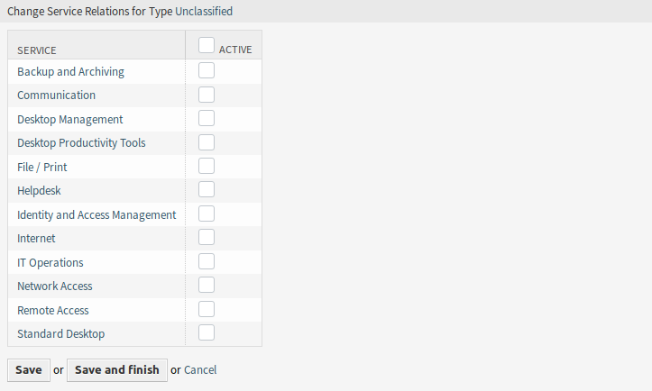
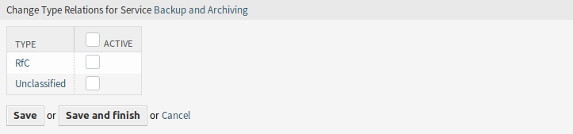

Types ↔ Services
================

Use this screen to add one or more types to one or more services. To use this function, at least one type and one service need to have been added to the system. The management screen is available in the *Types ↔ Services* module of the *Ticket Settings* group.

   Manage Type-Service Relations Screen

Manage Types ↔ Services Relations
----------------------------------

To assign a type to a service:

1. Click on a type in the *Types* column.
2. Select the services you would like to add the type to.
3. Click on the *Save* or *Save and finish* button.

   Change Service Relations for Type

To assign a service to a type:

1. Click on a service in the *Services* column.
2. Select the types you would like to assign the service to.
3. Click on the *Save* or *Save and finish* button.

   Change Type Relations for Service

.. note::

   If several types or services are added to the system, use the filter box to find a particular type or service by just typing the name to filter.

Multiple types or services can be assigned in both screens at the same time. Additionally clicking on a type or clicking on a service in the relations screen will open the *Edit Type* screen or the *Edit Service* screen accordingly.

.. warning::

   Accessing a type or a service provides no back link to the relations screen.
