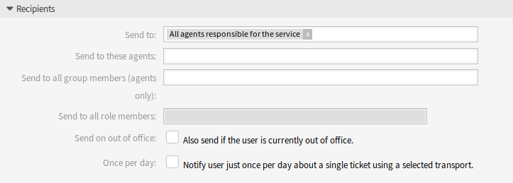

Ticket Notifications
====================

After installation of the package a new option will be available for the *Send to* field of the *Recipients* widget.

Manage Ticket Notifications
---------------------------

This feature add-on adds a new notification option for the service responsible agent.

Ticket Notification Settings
----------------------------

The following settings are available when adding or editing this resource. The fields marked with an asterisk are mandatory.

.. seealso::

   For an example, see a default ticket notification which is included in a fresh OTRS installation.

Recipients
^^^^^^^^^^

   Ticket Notification Settings - Recipients

Send to
   The service responsibilities of all assigned agents can be chosen with the option *All agents responsible for the service* to notify the responsible agents.

All other setting and options are part of the OTRS framework.
