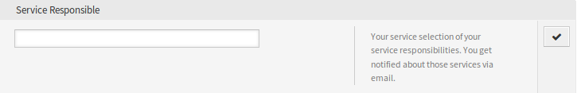

Personal Preferences
====================

After installation of the package a new widget will be available in the *Notification Settings* module in the *Personal Preferences* screen.

Notification Settings
---------------------

These settings are for customizing personal notifications.

Service Responsible
~~~~~~~~~~~~~~~~~~~

In this widget the agents can set services to be a responsible agent to those services.

   Service Responsible Widget

Select one or more services from the drop-down list.

.. note::

   To activate this widget in personal preferences, you need to enable the following system configuration options:

   - ``Ticket::Service``
   - ``Ticket::Responsible``
