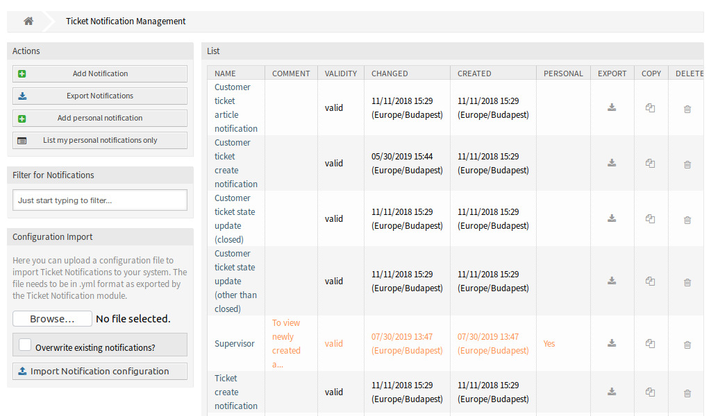
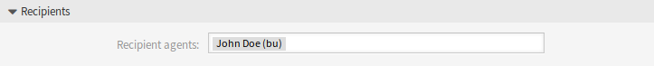

Ticket Notifications
====================

This screen gets two new buttons in the left sidebar and a new column in the overview table.

   Ticket Notification Management Screen

Administrators are still able to see all available notification entries. To be able to differentiate between entries of administrators and agents, there is a new column *Personal* in the notification overview. The entries of agents are marked in orange and have the value *Yes* in the column *Personal*.

Furthermore it is still possible to add other agents as email recipients in every new or modified notification entry, including notification entries of agents.

Manage Personal Ticket Notifications
------------------------------------

To add a personal ticket notification:

1. Click on the *Add personal notification* button in the left sidebar.
2. Fill in the required fields.
3. Click on the *Save* button.

To edit a personal ticket notification:

1. Click on a ticket notification in the list of ticket notifications in a row that is displayed in orange.
2. Modify the fields.
3. Click on the *Save* or *Save and finish* button.

To delete a personal ticket notification:

1. Click on the trash icon in the list of ticket notifications in a row that is displayed in orange.
2. Click on the *Confirm* button.

To list only the personal notifications:

1. Click on the *List my personal notifications only* button in the left sidebar.
2. Click on the *List all notifications* button to restore the overview.

Adding a notification can be done with the same procedure that is described in the `administrator manual <https://doc.otrs.com/doc/manual/admin/7.0/en/content/communication-notifications/ticket-notifications.html#ticket-notification-settings>`__. There is only one difference: the *Recipients* section.

   Ticket Notification Settings - Recipients

In case of adding a personal ticket notification, only the personal email address of the administrator or agent can be selected in the *Recipients* section.
