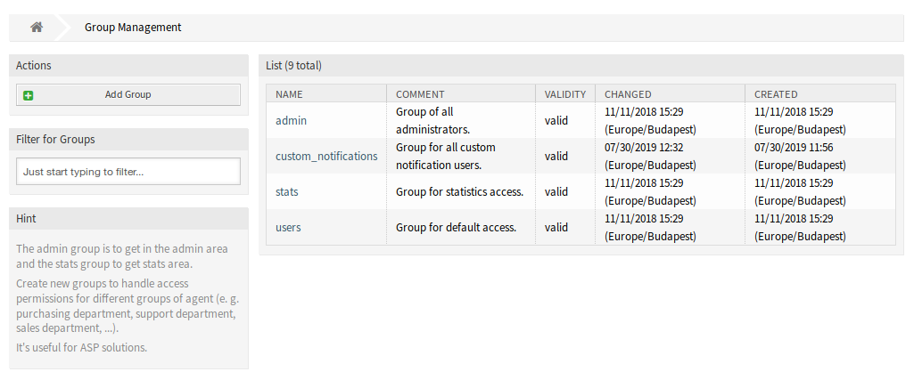

Groups
======

Access to the personal notification module is managed on a role-based access concept. After installation of the package a new group is added to the system. The group management screen is available in the *Groups* module of the *Users, Groups & Roles* group.

   Group Management Screen

New Group
---------

After installation of the package the following group is added to the system:

*custom_notifications*
   Every agent who is a member of this group gets a *Custom Notifications* widget in the bottom of the *Notification Settings* module of :doc:`../../agent/avatar/personal-preferences` screen.

.. note::

   The primary administrator user (root@localhost) is added to all groups with permission *rw* by default.

.. seealso::

   To set the correct permissions for other agents, check the following relations:

   - *Agents ↔ Groups*
   - *Roles ↔ Groups*
