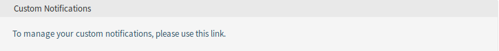
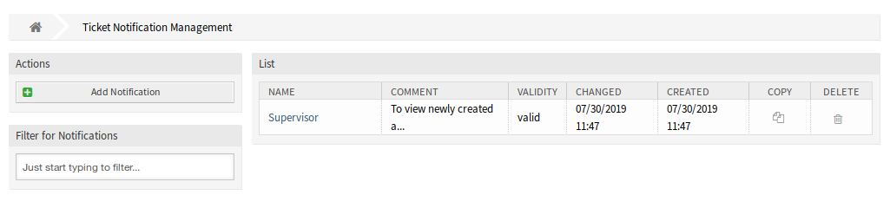

Personal Preferences
====================

This package adds a new *Custom Notifications* widget to the bottom of the *Notification Settings* module of *Personal Settings*.

Notification Settings
---------------------

Every agent who is a member of the group ``custom_notifications`` gets a *Custom Notifications* widget in the bottom of the *Notification Settings* module of *Personal Settings*.

Custom Notifications
~~~~~~~~~~~~~~~~~~~~

This widget contains a link that points to the :doc:`../../admin/communication-notifications/ticket-notifications` screen of the administrator interface, if an administrator clicks on the link. If an agent clicks on it, it opens a reduced variant of the *Ticket Notifications* screen.

   Custom Notifications Widget

The *Ticket Notifications* screen does not contain the administrative elements, if an agent opens it.

   Ticket Notification Management Screen

To add a personal ticket notification:

1. Click on the *Add personal notification* button in the left sidebar.
2. Fill in the required fields.
3. Click on the *Save* button.

To edit a personal ticket notification:

1. Click on a ticket notification in the list of ticket notifications in a row that is displayed in orange.
2. Modify the fields.
3. Click on the *Save* or *Save and finish* button.

To delete a personal ticket notification:

1. Click on the trash icon in the list of ticket notifications in a row that is displayed in orange.
2. Click on the *Confirm* button.

The agent is able to create his own notifications, like administrators can do, except the recipient addresses. Every event that an agent creates, will send emails to its own primary email. This recipient address is mandatory and cannot be switched to another one.

The related agent is only able to see, create, edit and/or delete his own notification entries. It is not possible to see or modify notification entries of other agents.
