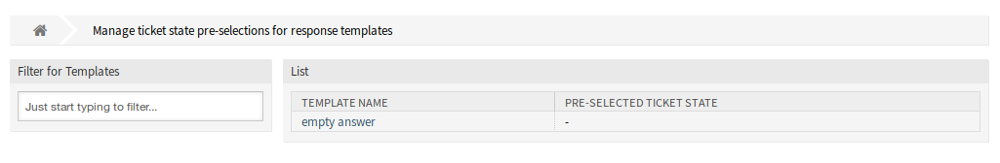
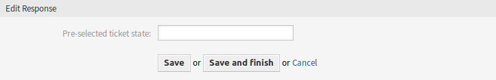

State Pre-selection for Templates
=================================

Use this screen to assign a ticket state to response templates. The ticket state will be pre-selected when answering a ticket via the response template. The management screen is available in the *State Pre-selection for Templates* module of the *Ticket Settings* group.

   Ticket State Pre-selections For Response Templates Management Screen

Manage Responses
----------------

To assign a ticket state to a response template:

1. Click on a template in the list of templates.
2. Select a ticket state for the response template.
3. Click on the *Save* or *Save and finish* button.

   Edit Response Screen

.. note::

   The configured ticket states must be allowed in ticket context as next state. If this should not be the case, no next state will be pre-selected when answering a ticket.

.. note::

   If several templates are added to the system, use the filter box to find a particular template by just typing to filter.

Response Settings
-----------------

The following settings are available when adding or editing this resource. The fields marked with an asterisk are mandatory.

Pre-selected ticket state
   Select a ticket state to assign it to the template. This ticket state will be pre-selected on *Ticket Compose* screen when answering a ticket using this response template.
