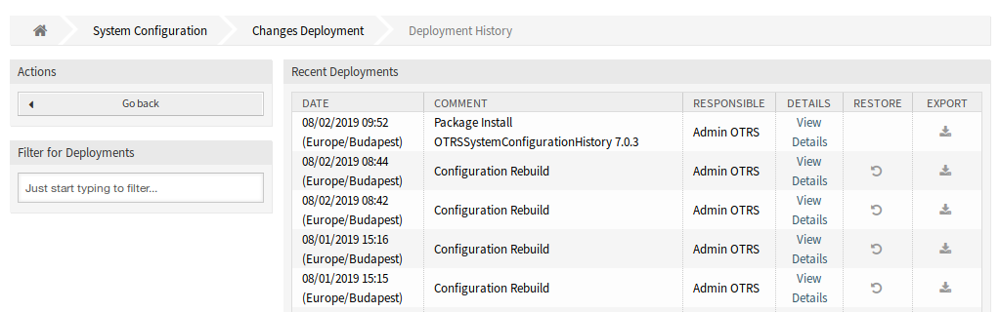
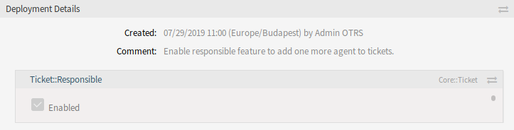
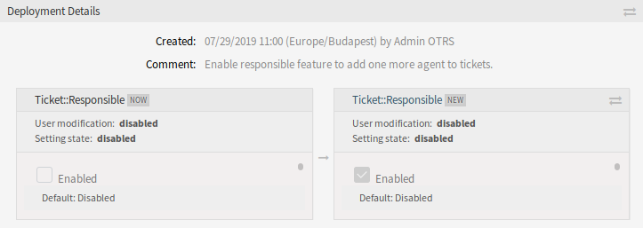
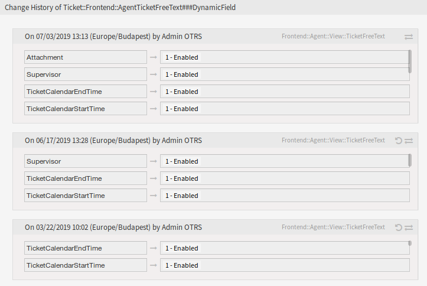

System Configuration
====================

The feature add-on adds new screens to the *Changes Deployment* screen and for the individual settings. These screens will display recent deployments in a descending order, along with their comments and name of the user who deployed the changes.

Deployment History
------------------

To see the deployment history:

1. Go to the *System Configuration* screen of the administrator interface.
2. Click on the *Deployment* button.
3. Click on the *History* button.

   Deployment History Screen

Every deployment can be further inspected by clicking on *View Details* link next to it. Details screen can be used to compare the setting with its previous value, before the deployment took place.

   Deployment Details Screen

It is possible to compare the old and the new settings side-by-side by clicking on the two arrows button.

   Deployment Details Difference

Additionally, older deployments (every one before current state) can be restored with a simple click. By restoring a deployment, all settings will be reverted to the value they had at the
time of the deployment in question.

Finally, deployments can be exported with click on the export button. User will be presented with a download of a YML file that contains changed settings. This YML file can be later restored via *Import & Export* screen in the system configuration screen.

.. note::

   If several history entries are displayed in the history, use the filter box to find a particular log entry by just typing the name to filter.

Setting History
---------------

Specific setting history can be accessed via *History* button in the setting widget. This button opens a screen of all values setting had over different deployments. Information like name of the user that made the change and time of change is displayed, along with a useful comparison tool.

To see the setting history:

1. Go to the *System Configuration*  screen of the administrator interface.
2. Search for a system configuration setting.
3. Open the setting for editing and click on its header to reveal the buttons.
4. Click on the *History* button.

   Change History Screen

Every historical setting value can be restored by clicking on the *Restore* button in top right corner of the widget.
